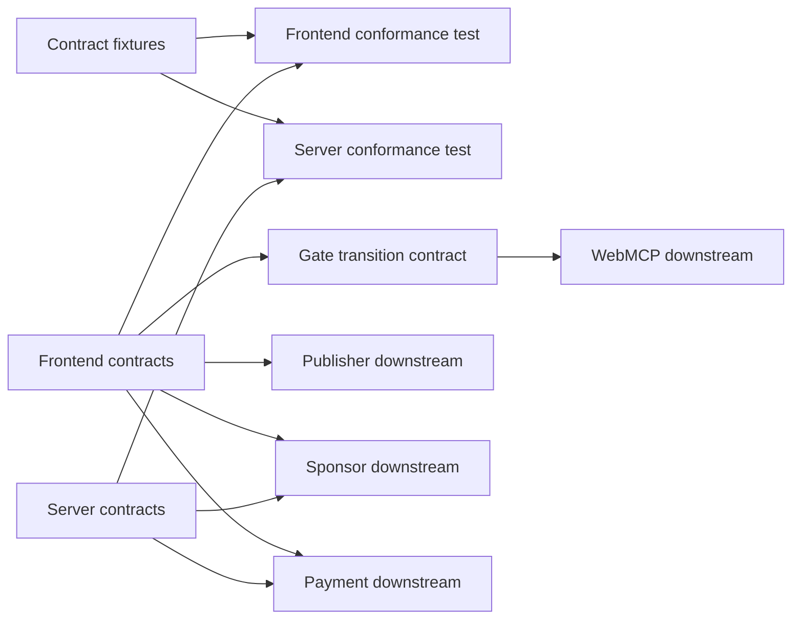
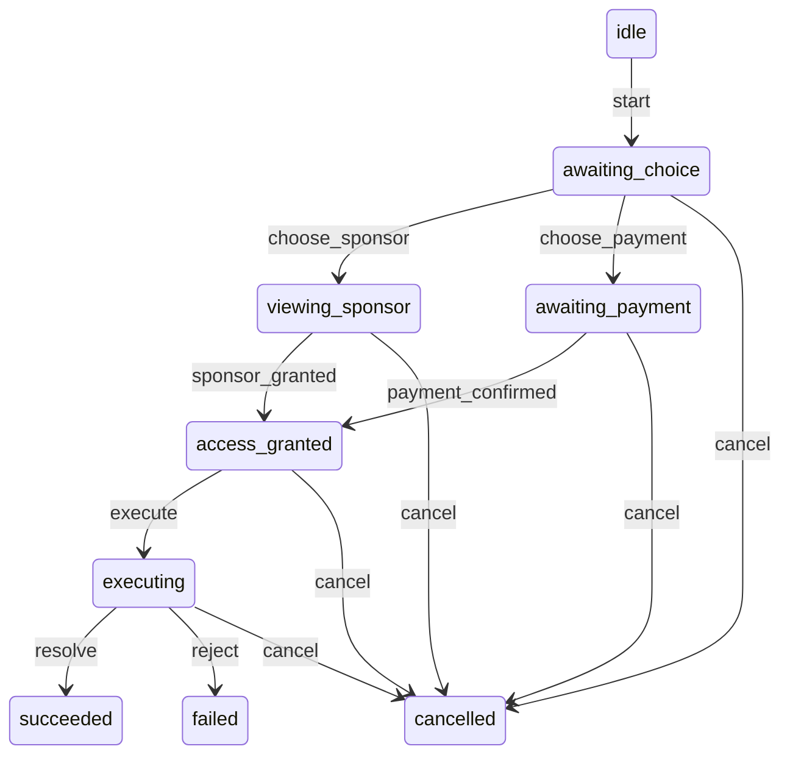
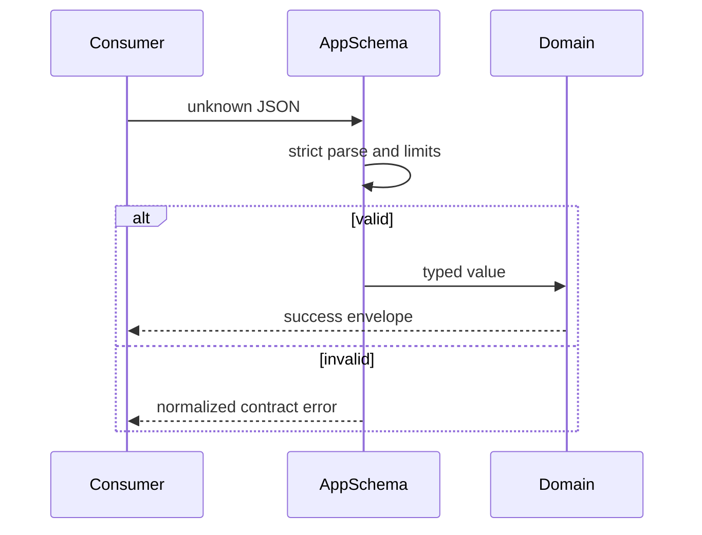

# Design Document

## Overview

本機能は、AdGate の frontend と resource server に `recipe_analysis` 用の同一意味論を持つ runtime contract を導入し、後続仕様が独立して実装できる安定した境界を提供する。Zod スキーマ、TypeScript の判別可能 union、純粋なゲート遷移関数、およびアプリ間で共有する JSON fixture によって、入力・出力・アクセス証跡・エラー・状態遷移の解釈差を検出する。

共有 runtime package は作らない。frontend と server は各自の外部境界にスキーマを所有し、単一の適合 fixture を双方のテストで読み込む。これによりハッカソン期間中の package 公開・build graph 追加を避けつつ、契約ドリフトを CI で検出する。

### Goals

- `recipe_analysis` の厳格で JSON-safe な要求・応答契約を固定する。
- ゲート状態、イベント、終端条件、無効遷移を決定的に定義する。
- スポンサー付与と Base Sepolia x402 支払い証跡を判別可能にする。
- frontend/server の契約互換性を同じ fixture で継続検証する。

### Non-Goals

- sponsor grant の発行・保存・消費、x402 の署名・検証・決済。
- premium analysis の生成、HTTP handler、UI、WebMCP tool 登録。
- 汎用契約 SDK、workspace 共通 package、永続データモデル。

## Boundary Commitments

### This Spec Owns

- `recipe_analysis` の識別子、入力、出力、HTTP envelope、アクセス証跡、エラーの canonical field 名と意味。
- frontend のゲート状態・イベント union と純粋な遷移規則。
- frontend/server の境界スキーマ、および両者へ同じ判定を要求する適合 fixture。
- WebMCP host へ返す成功・失敗結果の JSON-safe 正規形。

### Out of Boundary

- `publisher-demo`: recipe UI と deterministic analysis 実装。
- `sponsor-access`: sponsor UI、timer、grant ledger、発行・消費処理。
- `x402-payment-access`: 402 challenge、wallet confirmation、payment header、facilitator 連携。
- `webmcp-gated-tool`: tool lifecycle、pending promise、abort propagation。
- route middleware、CORS、deployment、および永続化。

### Allowed Dependencies

- frontend/server はそれぞれ `zod` 4 系と TypeScript/ESM を利用できる。
- gate transition contract は frontend contract の型だけへ依存する。
- 各 app の contract test は `test/fixtures/adgate-contracts.json` を read-only の適合入力として利用できる。
- 依存方向は `fixture -> app contract test` と `contract types -> gate transition -> downstream feature` に限定し、frontend と server は互いを import しない。

### Revalidation Triggers

- field 名、必須性、上限、判別子、時刻・金額表現、error code の変更。
- gate state、event、遷移、終端条件の変更。
- HTTP method、path、header、status、envelope の変更。
- Base Sepolia network ID、asset 表現、x402 evidence の対応情報の変更。
- fixture の schema version または runtime validator の major version 変更。

## Architecture

### Existing Architecture Analysis

- frontend は `zod/mini` の schema から型と WebMCP JSON Schema を生成し、外部 tool input を `safeParse` する。
- server は Hono と x402 middleware を持つが、現状の `/weather` payload に domain schema がない。
- workspace に共有 runtime package はなく、各 app は独立した package boundary を持つ。
- 本設計は既存の「境界で Zod 検証」「TypeScript/ESM」「app 間の trust boundary 分離」を維持する。

### Architecture Pattern & Boundary Map



**Architecture Integration**:

- Selected pattern: duplicated boundary validators with fixture-driven consumer conformance。runtime coupling を作らず意味論を同期する。
- Domain boundaries: frontend は browser state と host normalization、server は HTTP boundary validation を所有する。
- Existing patterns preserved: schema-first 型推論、ESM、app-local imports、Vitest。
- New components rationale: gate machine は状態遷移を一箇所へ集約し、fixture suite は意図しない契約差を検出する。
- Steering compliance: browser secret を扱わず、Base Sepolia のみを許可し、未知入力を fail-fast する。

### Technology Stack

| Layer | Choice / Version | Role in Feature | Notes |
|-------|------------------|-----------------|-------|
| Frontend | TypeScript 6 / Zod 4.4 / Vitest 4 | browser contract、gate state、適合 test | 既存依存を利用 |
| Backend | TypeScript / Zod 4.4 / Vitest 4 | HTTP boundary contract、適合 test | server に Zod と test tooling を追加 |
| Data | JSON fixture schema v1 | app 間の contract oracle | runtime import は禁止 |

## File Structure Plan

### Directory Structure

```text
apps/
├── frontend/src/adgate/
│   ├── contracts.ts             # browser domain and HTTP schemas, types, host normalization
│   ├── gateMachine.ts           # deterministic gate transition function and table
│   └── contracts.test.ts        # frontend fixture and transition conformance
└── server/src/adgate/
    ├── contracts.ts             # server HTTP schemas and normalized evidence/error types
    └── contracts.test.ts        # server fixture conformance
test/fixtures/
└── adgate-contracts.json        # versioned valid and invalid cross-app examples
```

### Modified Files

- `apps/server/package.json` — Zod、Vitest、test script を追加し server boundary test を実行可能にする。
- `pnpm-lock.yaml` — server の追加 test/runtime dependencies を workspace lockfile に固定する。

各 runtime file は自 app のみから import する。fixture は test 専用であり production bundle に含めない。

## System Flows

### Gate State Transition



`failed`、`succeeded`、`cancelled` は終端状態である。任意の未終端状態は、その状態で明示的に許可された event のみを受け付ける。新しい試行は常に `idle` から新しい `attemptId` で開始し、終端状態を再利用しない。

### Boundary Validation



## Requirements Traceability

| Requirement | Summary | Components | Interfaces | Flows |
|-------------|---------|------------|------------|-------|
| 1.1, 1.2, 1.3 | resource ID と分析 payload | FrontendContracts, ServerContracts | AnalysisInput, AnalysisResult | Boundary Validation |
| 1.4, 1.5 | strict limits と JSON safety | FrontendContracts, ServerContracts | strict schemas, JsonValue | Boundary Validation |
| 2.1, 2.2, 2.3 | state、event、有効・無効遷移 | GateMachine | GateState, GateEvent, transitionGate | Gate State Transition |
| 2.4, 2.5 | terminal state と再開禁止 | GateMachine | GateTransitionResult | Gate State Transition |
| 3.1, 3.2, 3.3 | 判別可能な二種の evidence | FrontendContracts, ServerContracts | AccessEvidence | Boundary Validation |
| 3.4, 3.5 | resource binding と secret 排除 | ServerContracts, ConformanceFixtures | access schemas | Boundary Validation |
| 4.1, 4.2, 4.3 | 絶対時刻、expiry、single use | FrontendContracts, ServerContracts | SponsorAccessEvidence | Boundary Validation |
| 4.4, 4.5 | idempotency の同一性・競合 | ServerContracts | PremiumAnalysisRequest | Boundary Validation |
| 5.1, 5.2 | error taxonomy と envelope | FrontendContracts, ServerContracts | AdGateError | Boundary Validation |
| 5.3, 5.4, 5.5 | sanitization と正規化 | FrontendContracts, ServerContracts | normalizeContractError | Boundary Validation |
| 6.1, 6.2 | cross-app examples | ConformanceFixtures | FixtureDocument | Boundary Validation |
| 6.3 | WebMCP host 正規形 | FrontendContracts | WebMCPToolResult | Boundary Validation |
| 6.4, 6.5 | breaking change 検出と非責務 | ConformanceFixtures | schemaVersion, fixture tests | Boundary Validation |

## Components and Interfaces

| Component | Domain/Layer | Intent | Req Coverage | Key Dependencies | Contracts |
|-----------|--------------|--------|--------------|------------------|-----------|
| FrontendContracts | Browser boundary | browser と WebMCP の canonical runtime contract | 1.1–1.5, 3.1–3.5, 4.1–4.3, 5.1–5.5, 6.3 | Zod P0 | Service, API |
| ServerContracts | HTTP boundary | premium endpoint と evidence の strict validation | 1.1–1.5, 3.1–4.5, 5.1–5.5 | Zod P0 | Service, API |
| GateMachine | Browser state | event に対する決定的な状態遷移 | 2.1–2.5 | FrontendContracts P0 | Service, State |
| ConformanceFixtures | Test contract | app 間の意味論一致を検証 | 6.1–6.5 | FrontendContracts P0, ServerContracts P0 | Batch |

### Browser Boundary

#### FrontendContracts

| Field | Detail |
|-------|--------|
| Intent | browser が受信・送信・host 返却する値を strict parse する |
| Requirements | 1.1–1.5, 3.1–3.5, 4.1–4.3, 5.1–5.5, 6.3 |

**Responsibilities & Constraints**

- 全 object schema は unknown key を拒否する。
- runtime schema を型の唯一の source とし、`z.infer` で公開型を導出する。
- WebMCP output は plain JSON の成功/失敗判別 union に限定する。
- 秘密鍵、署名 seed、未加工例外を型または envelope に含めない。

**Dependencies**

- External: `zod/mini` — runtime parse と JSON Schema 生成 (P0)
- Outbound: GateMachine と後続 frontend specs — canonical types (P0)

**Contracts**: Service [x] / API [x] / Event [ ] / Batch [ ] / State [ ]

```typescript
type ResourceId = "recipe_analysis";
type JsonPrimitive = string | number | boolean | null;
type JsonValue = JsonPrimitive | JsonValue[] | { [key: string]: JsonValue };

interface RecipeAnalysisInput {
  recipeTitle: string;          // trimmed, 1..120
  ingredients: string[];        // 1..50, each trimmed 1..200
  instructions: string[];       // 1..30, each trimmed 1..500
  dietaryGoals?: string[];      // 0..10, each trimmed 1..80
}

interface RecipeAnalysisResult {
  summary: string;               // 1..1000
  nutritionalInsights: string[]; // 1..10, each 1..300
  suggestions: string[];         // 1..10, each 1..300
  disclaimer: string;            // 1..500
}

type WebMCPToolResult =
  | { ok: true; resourceId: ResourceId; data: RecipeAnalysisResult }
  | { ok: false; error: AdGateError };

function normalizeWebMCPResult(
  value: PremiumAnalysisSuccess | AdGateErrorEnvelope,
): WebMCPToolResult;
```

- Preconditions: 入力は `unknown` として schema へ渡す。
- Postconditions: 成功値は `JSON.stringify` 可能で undefined、bigint、Date を含まない。
- Invariants: `resourceId` は常に `recipe_analysis`。

#### GateMachine

| Field | Detail |
|-------|--------|
| Intent | gate の状態、event、許可遷移を純粋関数で表現する |
| Requirements | 2.1–2.5 |

**Responsibilities & Constraints**

- state と event は `type` field の判別可能 union とする。
- transition は I/O、timer、React state、payment/sponsor 実装を呼ばない。
- invalid event は throw せず、元 state と `INVALID_TRANSITION` error を返す。

**Dependencies**

- Inbound: 後続 gate coordinator — state update (P0)
- Outbound: FrontendContracts — request、evidence、result、error types (P0)

**Contracts**: Service [x] / API [ ] / Event [x] / Batch [ ] / State [x]

```typescript
type GateState =
  | { type: "idle" }
  | { type: "awaiting_choice"; attemptId: string; input: RecipeAnalysisInput }
  | { type: "viewing_sponsor"; attemptId: string; sponsorId: string; startedAt: string }
  | { type: "awaiting_payment"; attemptId: string; paymentRequestId: string }
  | { type: "access_granted"; attemptId: string; evidence: AccessEvidence }
  | { type: "executing"; attemptId: string; evidence: AccessEvidence }
  | { type: "succeeded"; attemptId: string; result: RecipeAnalysisResult }
  | { type: "failed"; attemptId: string; error: AdGateError }
  | { type: "cancelled"; attemptId: string; reason: "user" | "abort" | "unmounted" };

type GateTransitionResult =
  | { ok: true; state: GateState }
  | { ok: false; state: GateState; error: AdGateError };

function transitionGate(state: GateState, event: GateEvent): GateTransitionResult;
```

- Preconditions: event payload は対応 schema で検証済み。
- Postconditions: 同じ state と event は構造的に同じ result を返す。
- Invariants: attempt-scoped event の `attemptId` は current state と一致する。

### HTTP Boundary

#### ServerContracts

| Field | Detail |
|-------|--------|
| Intent | server が premium request、access evidence、response を strict parse する |
| Requirements | 1.1–1.5, 3.1–4.5, 5.1–5.5 |

**Responsibilities & Constraints**

- frontend と同じ domain field、limit、判別子を独立 schema として定義する。
- idempotency key は 16..128 文字の opaque ASCII、request ID は 1..128 文字とする。
- ISO 8601 UTC timestamp の文字列表現を採用し、比較時は `now >= expiresAt` を expired とする。
- 金額は token base unit の非負 decimal string とし、浮動小数を禁止する。

**Dependencies**

- Inbound: 後続 Hono route と sponsor/payment authorization (P0)
- External: Zod 4.4 — runtime validation (P0)

**Contracts**: Service [x] / API [x] / Event [ ] / Batch [ ] / State [ ]

```typescript
type AccessEvidence = SponsorAccessEvidence | PaymentAccessEvidence;

interface SponsorAccessEvidence {
  kind: "sponsor_grant";
  grantId: string;
  resourceId: "recipe_analysis";
  issuedAt: string;
  expiresAt: string;
  nonce: string;
}

interface PaymentAccessEvidence {
  kind: "x402_payment";
  resourceId: "recipe_analysis";
  paymentRequestId: string;
  transactionHash: `0x${string}`;
  network: "eip155:84532";
  asset: `0x${string}`;
  amount: string;
  confirmedAt: string;
}

interface PremiumAnalysisRequest {
  requestId: string;
  idempotencyKey: string;
  resourceId: "recipe_analysis";
  input: RecipeAnalysisInput;
}

interface PremiumAnalysisSuccess {
  ok: true;
  requestId: string;
  resourceId: "recipe_analysis";
  access: { kind: AccessEvidence["kind"]; referenceId: string };
  data: RecipeAnalysisResult;
}
```

##### API Contract

| Method | Endpoint | Request | Response | Errors |
|--------|----------|---------|----------|--------|
| POST | `/api/recipe-analysis` | `PremiumAnalysisRequest`; sponsor token または x402 header は後続仕様が付与 | `200 PremiumAnalysisSuccess` | `400`, `401`, `402`, `409`, `410`, `422`, `503`, `500` の `AdGateErrorEnvelope` |
| POST | `/api/sponsor-grants` | `SponsorGrantIssueRequest` | `201 SponsorGrantIssueResponse` | 同じ error envelope。route 実装は sponsor-access 所有 |

HTTP header 名は `Idempotency-Key`、`Authorization: Sponsor <opaque-token>`、x402 標準の `PAYMENT-SIGNATURE` とする。body 内の `idempotencyKey` は header 値と一致しなければ `IDEMPOTENCY_CONFLICT` とする。x402 challenge/settlement payload 自体は x402 package が所有し、本契約は成功後の正規化 evidence のみを定義する。

### Test Contract

#### ConformanceFixtures

| Field | Detail |
|-------|--------|
| Intent | frontend/server の validators が同じ例を同じ結果として判定することを保証する |
| Requirements | 6.1–6.5 |

**Responsibilities & Constraints**

- fixture root は `{ schemaVersion: 1, cases: [...] }` の strict JSON document とする。
- 各 case は `contract`、`expect`、`value`、任意の `errorCode` を持つ。
- valid/invalid の双方に境界値、unknown key、oversize、expiry equality、wrong resource/network、secret-like key を含める。
- fixture は実行コードを含まず、各 app test が自 schema registry へ case 名を map する。

**Contracts**: Service [ ] / API [ ] / Event [ ] / Batch [x] / State [ ]

##### Batch Contract

- Trigger: frontend/server の unit test 実行。
- Input / validation: schemaVersion 1 の fixture JSON。
- Output / destination: 各 case の parse 成否と期待 error code の一致。
- Idempotency & recovery: fixture は immutable test input。同一 commit で常に同じ結果を返す。

## Data Models

### Domain Model

- `RecipeAnalysisInput` と `RecipeAnalysisResult` は resource payload value object。
- `GateState` は browser 内の一試行を aggregate とし、`attemptId` が event の所属を拘束する。
- `AccessEvidence` は authorization 実装が生成する immutable value object。contract 層は消費状態を保存しない。
- `AdGateError` は全境界で利用する公開 error value object。

### Data Contracts & Integration

```typescript
type AdGateErrorCode =
  | "INVALID_INPUT"
  | "INVALID_TRANSITION"
  | "ACCESS_REQUIRED"
  | "INVALID_EVIDENCE"
  | "ACCESS_EXPIRED"
  | "ACCESS_REUSED"
  | "IDEMPOTENCY_CONFLICT"
  | "CANCELLED"
  | "DEPENDENCY_UNAVAILABLE"
  | "INTERNAL_ERROR";

interface AdGateError {
  code: AdGateErrorCode;
  message: string;
  retryable: boolean;
  correlationId?: string;
  issues?: Array<{ path: string; message: string }>;
}

interface AdGateErrorEnvelope {
  ok: false;
  error: AdGateError;
}

function normalizeContractError(cause: unknown, correlationId?: string): AdGateError;
```

全 object schema は strict、全 string は明示上限付きとする。`issuedAt < expiresAt`、Base Sepolia `eip155:84532`、同じ `resourceId`、transaction hash/address の hex 形式は schema の refinement で検証する。日時は JSON 内で UTC ISO string、金額は base-unit decimal string とし、Date・bigint・undefined は境界へ出さない。

## Error Handling

### Error Strategy

- Zod issue は `INVALID_INPUT` と安全な `issues.path` へ変換し、入力値そのものは echo しない。
- 無効遷移は `INVALID_TRANSITION` を返し、元 state を保持する。
- unknown error は `INTERNAL_ERROR`、`retryable: false`、固定 message へ正規化する。
- dependency timeout/unavailable のみ `DEPENDENCY_UNAVAILABLE`、`retryable: true` とする。
- access error code と HTTP status の対応は固定する: required 402、invalid 401、expired 410、reused/conflict 409、invalid input 400、dependency 503、internal 500。

### Monitoring

contract は任意の `correlationId` を伝播するが生成・logging は後続 route が所有する。公開 error に stack、env、wallet payload、未加工 provider response を含めないことを test する。

## Testing Strategy

### Unit Tests

- FrontendContracts: 各 input 上限の直前・境界・超過、unknown key、JSON-unsafe 値を検証する (1.1–1.5)。
- GateMachine: transition table の全許可 edge、全 state の代表的な不許可 event、attempt mismatch、終端 state を検証する (2.1–2.5)。
- ServerContracts: evidence 判別子、resource binding、UTC timestamp、expiry equality、Base Sepolia 固定、decimal amount を検証する (3.1–4.5)。
- Error normalization: Zod/unknown/dependency error の code、retryable、sanitization を検証する (5.1–5.5)。
- WebMCP normalization: success/error の出力が JSON round-trip 後も同値であることを検証する (6.3)。

### Integration Tests

- 同一 fixture の全 valid case を frontend/server の対応 schema が受理する (6.1, 6.2)。
- 同一 fixture の全 invalid case を双方が拒否し、期待 error code に正規化する (6.1, 6.2)。
- schema field または required 条件を片側だけ変更した場合、fixture test が失敗することを mutation case で確認する (6.4)。
- sponsor/payment の業務処理が fixture test から呼ばれないことを import boundary で確認する (6.5)。

### Security Considerations

- secret-like key (`privateKey`, `seed`, `mnemonic`) を evidence の unknown key として拒否する。
- payment evidence は Base Sepolia のみを受理し、World Chain と mainnet network ID を拒否する。
- error sanitization test では secret marker と stack marker が serialized output に存在しないことを確認する。
- fixture に実 secret、署名、利用可能な token を格納しない。
