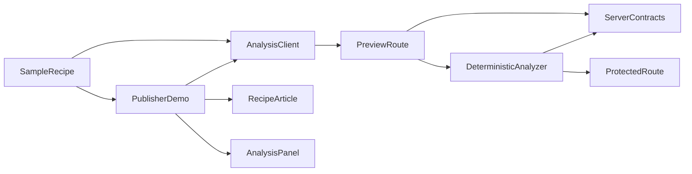
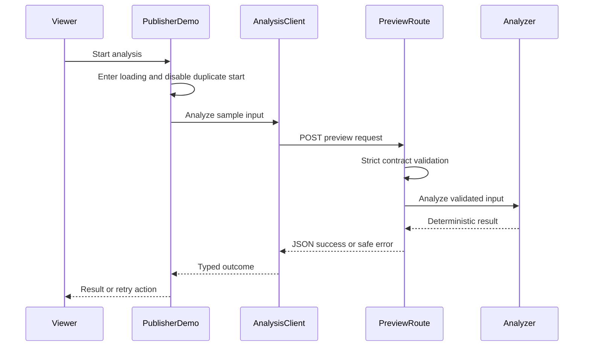

# Design Document

## Overview

`publisher-demo` は既存の todo composition を、単一の公開レシピと直接実行できる premium analysis preview へ置き換える。frontend は静的で所有権が明確なレシピデータを唯一の表示入力として使い、同じデータから `RecipeAnalysisInput` を生成する。resource server は `adgate-contracts` の schema で要求を検証し、外部 AI や時刻へ依存しない純粋な analyzer から `RecipeAnalysisResult` を返す。

本仕様の HTTP route は gate 統合前の検証専用 preview seam である。後続仕様は analyzer をそのまま canonical protected route から呼び、preview route を production で無効化する。これにより publisher の表現・分析ロジックと、sponsor/payment authorization の責務を混在させない。

### Goals

- レシピと premium analysis の価値が最初の画面から理解できる publisher UI を提供する。
- UI、HTTP boundary、analyzer の各段階で `recipe_analysis` 契約を維持する。
- 同一入力に対して JSON として同一の分析結果を返し、三分デモを再現可能にする。
- 後続 gate が UI と analyzer を再利用できる明確な seam を作る。

### Non-Goals

- sponsor、x402、wallet、access evidence、gate state、WebMCP 登録。
- 複数レシピ、検索、CMS、利用者入力、生成 AI、永続化。
- canonical protected route の authorization または production CORS/deployment 設定。

## Boundary Commitments

### This Spec Owns

- 単一レシピの表示用 metadata と canonical `RecipeAnalysisInput` への変換。
- publisher shell、recipe article、analysis preview の loading/success/error 表示。
- browser から preview route を呼ぶ typed client と要求重複防止。
- 入力にだけ依存する deterministic analyzer と preview HTTP handler。
- todo composition を publisher composition へ切り替える初期統合。

### Out of Boundary

- `adgate-contracts` が所有する field 名、limit、error taxonomy、runtime schema の変更。
- `sponsor-access` が所有する選択 UI、timer、grant ledger と sponsor route。
- `x402-payment-access` が所有する `/api/recipe-analysis` の protection、payment challenge、proof と settlement。
- `webmcp-gated-tool` が所有する pending tool、gate coordinator、abort と WebMCP status。
- preview route の production 無効化、strict origin allowlist、deployment は `submission-readiness` が最終確認する。

### Allowed Dependencies

- frontend は `apps/frontend/src/adgate/contracts.ts` の `RecipeAnalysisInput`、`RecipeAnalysisResult`、`AdGateError` と validators のみへ依存する。
- server は `apps/server/src/adgate/contracts.ts` の同名 domain/HTTP validators と error normalization のみへ依存する。
- UI は既存 React 19、Kumo、Phosphor icons、Tailwind を再利用し、新しい UI または data-fetching dependency を追加しない。
- route は既存 Hono app へ一度だけ mount し、analyzer は Hono、x402、React を import しない。
- production dependency direction は `adgate contracts → sample/domain → analyzer/client → route/UI → App composition` とし、逆向き import と frontend/server 間 import を禁止する。

### Revalidation Triggers

- `RecipeAnalysisInput`、`RecipeAnalysisResult`、`AdGateError`、request envelope の field、limit、判別子変更。
- sample recipe の title、ingredients、instructions、dietary goals の変更。
- preview または protected analysis route の path、method、status、response envelope の変更。
- sponsor/payment 統合により access-granted 後の呼出方法または top-level frontend composition が変わる場合。
- API base URL、CORS、Worker proxy、production preview availability の変更。

## Architecture

### Existing Architecture Analysis

- `App.tsx` が todo state、WebMCP registration、表示を一ファイルで構成しているため、publisher domain を新しい directory に分離して `App.tsx` を composition root に縮小する。
- frontend は Zod boundary schema と Vitest/Testing Library を既に使用する。契約は upstream の app-local schema を再利用し、独自の同義 schema を追加しない。
- server は `index.ts` で Hono app、x402 middleware、listen を直接構成し、現在は `/health` と `/weather` のみを持つ。analyzer と handler は新規 module に隔離し、既存 payment setup を変更しない。
- server の test runner と Zod dependency は `adgate-contracts` が準備するため、本仕様は追加 package を要求しない。

### Architecture Pattern & Boundary Map



**Architecture Integration**:

- Selected pattern: contract-first vertical slice。presentation、browser I/O、pure domain analysis、HTTP adaptation を分離する。
- Domain boundaries: sample recipe は frontend 表示値、analyzer は分析規則、route は transport validation のみを所有する。
- Existing patterns preserved: React function components、app-local relative imports、Zod boundary parsing、Hono handler、Vitest。
- New components rationale: `AnalysisClient` は UI を transport から分離し、`DeterministicAnalyzer` は authorization と無関係な再利用 seam を作る。
- Build vs adopt: UI と HTTP は既存 Kumo/Hono を採用する。分析は単一 owned sample だけが対象であり、外部 AI は決定性と availability を損なうため採用しない。

### Technology Stack

| Layer | Choice / Version | Role in Feature | Notes |
|-------|------------------|-----------------|-------|
| Frontend | React 19.2、Kumo 2.6、Tailwind 4.3 | publisher、recipe、analysis state の表示 | 既存 dependency のみ |
| Browser boundary | TypeScript 6、Zod 4.4 | preview request/response の strict validation | frontend contract を再利用 |
| Backend | Hono 4.13、TypeScript、Zod 4.4 | preview handler と deterministic analyzer | server contract を再利用 |
| Tests | Vitest 4.1、Testing Library 16.3 | pure logic、route、UI state の検証 | server runner は upstream 所有 |
| Data | static TypeScript value、owned SVG | 単一レシピと画像 | runtime storage なし |

## File Structure Plan

### Directory Structure

```text
apps/
├── frontend/
│   ├── public/
│   │   └── sesame-noodle-bowl.svg       # owned recipe hero artwork
│   └── src/
│       ├── publisher/
│       │   ├── sampleRecipe.ts           # displayed metadata and canonical analysis input
│       │   ├── analysisClient.ts         # typed preview fetch and response validation
│       │   ├── analysisClient.test.ts     # transport success and normalized failures
│       │   ├── RecipeArticle.tsx          # semantic recipe presentation
│       │   ├── AnalysisPanel.tsx          # idle, loading, success and error rendering
│       │   ├── PublisherDemo.tsx          # local request lifecycle and page composition
│       │   └── PublisherDemo.test.tsx     # accessible UI journey and duplicate prevention
│       ├── App.tsx                        # thin publisher composition root
│       └── styles.css                     # page baseline and publisher-specific visual tokens
└── server/src/
    └── recipeAnalysis/
        ├── analyzeRecipe.ts               # pure deterministic analysis service
        ├── analyzeRecipe.test.ts          # repeatability and unsupported-input tests
        ├── previewRoute.ts                # un-gated preview request/response adapter
        └── previewRoute.test.ts            # contract and status integration tests
test/fixtures/
└── publisher-demo.json                      # sample preview request and response test oracle
```

### Modified Files

- `apps/frontend/src/App.tsx` — todo composition を除き `PublisherDemo` を root にする。
- `apps/frontend/src/App.test.tsx` — starter 固有の todo assertions を root composition smoke test へ置換する。詳細 UI test は publisher directory に置く。
- `apps/frontend/src/styles.css` — 既存 baseline を維持し、レシピ記事の responsive typography と背景 token を追加する。
- `apps/server/src/index.ts` — preview router を `/api/recipe-analysis/preview` に mount するだけとし、既存 x402 middleware/config は変更しない。

既存 `useTodos.ts`、`useWebMCPTools.ts`、todo schemas の削除は本仕様に含めない。未使用化した starter module の整理は後続 integration が必要性を確認して行う。

## System Flows



preview request は一回の UI action につき一つで、pending 中の再操作は無視する。client は HTTP status と body を共同で検証し、unparseable response を `INTERNAL_ERROR`、network failure を `DEPENDENCY_UNAVAILABLE` に正規化する。

## Requirements Traceability

| Requirement | Summary | Components | Interfaces | Flows |
|-------------|---------|------------|------------|-------|
| 1.1, 1.2, 1.3, 1.4 | publisher 文脈、旧 UI 除去、gate 不在、再現性 | PublisherDemo, SampleRecipe | PublisherDemoProps | Page render |
| 2.1, 2.2, 2.3, 2.4, 2.5 | recipe detail と owned content | SampleRecipe, RecipeArticle | PublishedRecipe | Page render |
| 3.1, 3.2, 3.3, 3.4 | 分析開始、重複防止、結果、repeatability | PublisherDemo, AnalysisClient, AnalysisPanel | AnalysisClientPort, AnalysisViewState | Analysis preview |
| 3.5 | invalid request rejection | PreviewRoute | PreviewAnalysisRequest | Boundary validation |
| 4.1, 4.2, 4.3, 4.4, 4.5 | deterministic で安全な分析 | DeterministicAnalyzer | AnalysisOutcome | Analysis preview |
| 5.1, 5.2, 5.3, 5.4, 5.5 | safe error と retry | AnalysisClient, PublisherDemo, AnalysisPanel | AdGateError, AnalysisViewState | Analysis preview |
| 6.1, 6.2, 6.3, 6.4, 6.5 | responsive と accessible states | RecipeArticle, AnalysisPanel, PublisherDemo | semantic HTML, live status | Page render, Analysis preview |

## Components and Interfaces

| Component | Domain/Layer | Intent | Req Coverage | Key Dependencies | Contracts |
|-----------|--------------|--------|--------------|------------------|-----------|
| SampleRecipe | Frontend domain | 表示と分析で共有する immutable recipe | 1.4, 2.1–2.5, 3.1 | FrontendContracts P0 | State |
| RecipeArticle | UI | recipe detail の semantic presentation | 1.1, 2.1–2.5, 6.1–6.4 | SampleRecipe P0 | State |
| AnalysisPanel | UI | analysis lifecycle の accessible rendering | 3.2–3.4, 5.1–5.5, 6.1–6.5 | FrontendContracts P0 | State |
| PublisherDemo | UI coordinator | page composition と一要求の lifecycle | 1.1–1.4, 3.1–3.4, 5.4–5.5, 6.1–6.5 | AnalysisClient P0 | Service, State |
| AnalysisClient | Browser boundary | preview HTTP を typed outcome へ変換 | 3.1, 3.3–3.5, 5.1–5.3 | FrontendContracts P0, fetch P0 | Service, API |
| DeterministicAnalyzer | Server domain | input のみから canonical result を生成 | 4.1–4.5 | ServerContracts P0 | Service |
| PreviewRoute | Server HTTP | un-gated test seam の validation と status mapping | 3.5, 4.3, 4.5, 5.1–5.3 | ServerContracts P0, DeterministicAnalyzer P0 | API |
| AppComposition | Frontend integration | publisher slice を browser entry へ接続 | 1.1–1.4, 6.1–6.3 | PublisherDemo P0 | Service |
| ServerComposition | Server integration | preview router を既存 app へ接続 | 3.1, 3.5, 5.1–5.3 | PreviewRoute P0 | API |

### Frontend Domain and UI

#### SampleRecipe

```typescript
interface PublishedRecipe {
  slug: "sesame-noodle-bowl";
  title: string;
  dek: string;
  servings: number;
  totalMinutes: number;
  tags: readonly string[];
  image: { src: string; alt: string };
  analysisInput: RecipeAnalysisInput;
}
```

- `analysisInput.recipeTitle`、ingredients、instructions、dietaryGoals は画面本文の canonical source とする。
- 値は module-level immutable constant であり、localStorage、時刻、network から生成しない。

#### PublisherDemo

**Contracts**: Service [x] / API [ ] / Event [ ] / Batch [ ] / State [x]

```typescript
type AnalysisViewState =
  | { type: "idle" }
  | { type: "loading" }
  | { type: "success"; result: RecipeAnalysisResult }
  | { type: "error"; error: AdGateError };

interface AnalysisClientPort {
  analyze(input: RecipeAnalysisInput, signal?: AbortSignal): Promise<RecipeAnalysisResult>;
}

interface PublisherDemoProps {
  analysisClient?: AnalysisClientPort;
}
```

- browser client を prop 既定値として注入し、component test では fake port を使う。
- pending request ごとに `AbortController` を作り、unmount 時に cancel する。abort は利用者向け error を表示しない。
- `loading` 中の start/retry は新しい promise を作らない。
- presentation components は state を所有せず callback と typed value だけを受け取る。

#### AnalysisClient

**Contracts**: Service [x] / API [x] / Event [ ] / Batch [ ] / State [ ]

```typescript
interface PreviewAnalysisRequest {
  requestId: string;
  idempotencyKey: string;
  resourceId: "recipe_analysis";
  input: RecipeAnalysisInput;
}

type PreviewAnalysisResponse =
  | { ok: true; resourceId: "recipe_analysis"; data: RecipeAnalysisResult }
  | { ok: false; error: AdGateError };

function createAnalysisClient(options: {
  baseUrl: string;
  fetchImpl?: typeof fetch;
}): AnalysisClientPort;
```

##### API Contract

| Method | Endpoint | Request | Response | Errors |
|--------|----------|---------|----------|--------|
| POST | `/api/recipe-analysis/preview` | `PreviewAnalysisRequest` | `200 PreviewAnalysisResponse` success | `400`, `422`, `500`, `503` の `AdGateErrorEnvelope` |

- request ID と idempotency key は request 開始時に生成し、同一 network retry 内では保持する。
- success body の resource ID と result を frontend contract で parse してから UI へ渡す。
- preview response は access evidence を偽造しない。canonical protected success envelope は後続仕様だけが作る。

### Server Domain and HTTP

#### DeterministicAnalyzer

**Contracts**: Service [x] / API [ ] / Event [ ] / Batch [ ] / State [ ]

```typescript
type AnalysisOutcome =
  | { ok: true; data: RecipeAnalysisResult }
  | { ok: false; error: AdGateError };

interface RecipeAnalyzer {
  analyze(input: RecipeAnalysisInput): AnalysisOutcome;
}
```

- Preconditions: server contract schema で検証済みの input を受け取る。
- Postconditions: success は `RecipeAnalysisResult` schema に適合し、同じ input は deep-equal な data を返す。
- Invariants: I/O、Date、random、environment、external model を参照しない。sample title と canonical ingredients/instructions の組に対する owned result を返す。
- supported sample と一致しない有効 input は、安全な `INVALID_INPUT` outcome として扱う。

#### PreviewRoute

**Contracts**: Service [ ] / API [x] / Event [ ] / Batch [ ] / State [ ]

- request body と response body の双方を server contract で検証する。
- body parse/schema failure は 400 `INVALID_INPUT`、unsupported sample は 422 `INVALID_INPUT`、unknown exception は 500 `INTERNAL_ERROR` に正規化する。
- route は access header を検査せず、grant/payment evidence を生成しない。
- correlation ID は request header の安全な値を伝播できるが、秘密値や raw exception を返さない。

**Implementation Notes**

- Integration: existing Hono app は router を preview path に mount する。x402 middleware/config の対象 route は変更しない。
- Validation: route test は Hono の in-memory request を使い、listen port や外部 network を必要としない。
- Risks: preview は final monetization を bypass できるため、後続 gate 統合後に production から必ず外す。`submission-readiness` は production build で preview endpoint が到達不能であることを確認する。

## Data Models

### Domain Model

- `PublishedRecipe` は frontend-owned immutable value object。永続化 ID ではなく安定 slug を持つ。
- `RecipeAnalysisInput` と `RecipeAnalysisResult` は `adgate-contracts` owned cross-boundary value objects。
- `AnalysisViewState` は一つの visible preview request の browser-local state であり、page reload を越えて保存しない。
- `AnalysisOutcome` は analyzer の pure return value であり、HTTP status または authorization state を含めない。

### Data Contracts & Integration

- JSON request/response は undefined、Date、bigint を含まない。
- preview request は upstream の `PremiumAnalysisRequest` と同じ requestId、idempotencyKey、resourceId、input field を使う。
- preview success は `access` field を持たず、protected success と誤認させない。data field 自体は canonical `RecipeAnalysisResult` と完全一致する。
- frontend と server は互いの source を import せず、それぞれの app-local contract validator で同じ JSON を検証する。
- `test/fixtures/publisher-demo.json` は test-only の sample request/response oracle とし、frontend/server の test が独立に読み込む。production source から fixture または相手 app を import しない。

## Error Handling

### Error Strategy

- Browser transport failure: `DEPENDENCY_UNAVAILABLE`, retryable true、固定の再試行案内。
- Invalid/unparseable response: `INTERNAL_ERROR`, retryable false、raw body を非表示。
- Invalid request/sample mismatch: `INVALID_INPUT`, retryable false、入力値を echo しない。
- Abort/unmount: state update を行わず、error UI と log noise を生成しない。
- Unknown server failure: upstream normalizer により 500 `INTERNAL_ERROR` と安全な message へ変換する。

### Monitoring

preview route は method、path、status、correlation ID のみを既存 server log policy に渡せる。recipe body、stack、environment、headers 全体は記録しない。production observability integration は submission readiness の責務とする。

## Testing Strategy

### Unit Tests

- `sampleRecipe`: displayed ingredient/instruction lists と `analysisInput` の source が同じで、upstream input schema に適合することを検証する (2.1–2.3, 3.1)。
- `DeterministicAnalyzer`: 同一 input の deep equality、sample-specific finding、disclaimer、unsupported valid input の安全な error を検証する (4.1–4.5)。
- `AnalysisClient`: success parse、network failure、invalid JSON、wrong resource ID、AbortSignal を検証する (3.3–3.5, 5.1–5.3)。

### Integration Tests

- preview route が valid request を 200 canonical data、unknown field を 400、unsupported sample を 422、thrown error を sanitized 500 で返すことを検証する (3.5, 4.3, 4.5, 5.2–5.3)。
- frontend request fixture と server handler が request field を同じ意味で扱うことを検証する (2.2, 3.1, 4.3)。
- existing `/health` と x402 `/weather` composition が route mount 後も応答可能であることを smoke test する。

### E2E/UI Tests

- initial render が publisher value proposition、recipe title、materials、instructions、analysis CTA を表示し todo 文言を表示しないことを検証する (1.1–1.4, 2.1–2.3)。
- pending client を使い、loading announcement と disabled CTA、連打しても client call 一回を検証する (3.2, 6.3–6.5)。
- success client を使い、summary、insights、suggestions、disclaimer の各 semantic section と live update を検証する (3.3–3.4, 6.3–6.5)。
- rejected client から safe error、recipe 本文維持、retry 一回、回復後 result を検証する (5.1–5.5)。
- 320px 相当 viewport と keyboard traversal で horizontal overflow がなく CTA/retry に到達できることを検証する (6.1–6.2)。

### Security Considerations

- sample asset と content には外部 tracking、remote image、third-party script を含めない。
- frontend bundle と preview request に access token、private key、wallet data を含めない。
- error UI と response は raw exceptions、stack、request body、secret-like field を公開しない。
- preview endpoint は統合用 authorization の代替ではなく、final production release の blocking removal item とする。
