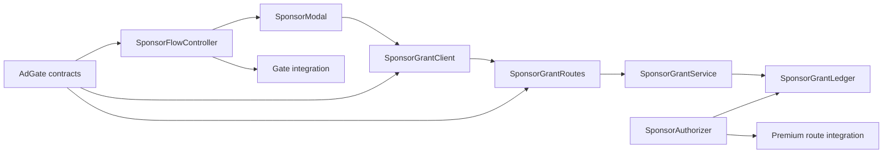
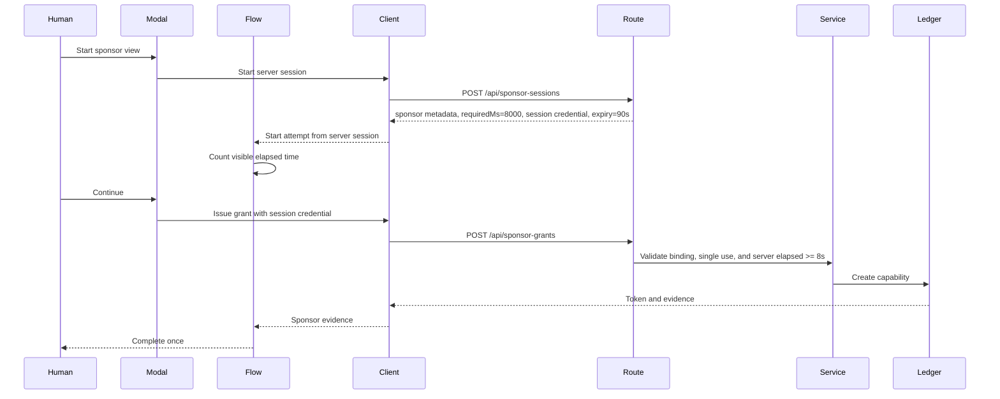
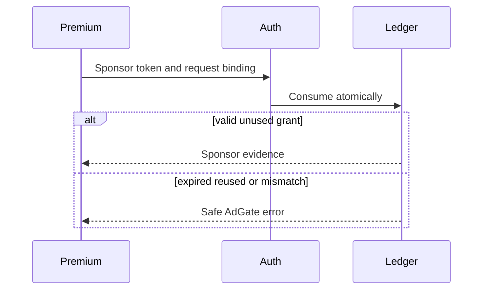

# Design Document

## Overview

本機能は、`recipe_analysis` を要求した人へウォレット不要のスポンサー経路を提示する。Hono側はresource/request/sponsorへbindingした90秒のsessionと開始時刻を発行し、React側は8 visible secondsを数え、serverが最低8秒のwall-clockを再検証した後だけ60秒・一回限りのスポンサーアクセスを発行する。

既存 `adgate-contracts` の `GateState`、`SponsorAccessEvidence`、`AdGateError`、HTTP header を変更せず利用する。スポンサー完了は証跡を下流へ返す地点までを本仕様の責務とし、共有 pending promise、WebMCP 登録、プレミアム分析実行の composition は後続仕様へ残す。

### Goals

- 明示操作、アクセシビリティ、可視時間に基づくスポンサー体験を提供する。
- `recipe_analysis` と要求 nonce に拘束された短期 opaque token を一度だけ発行・消費する。
- 時計、乱数、可視性を注入可能にし、取消・期限・リプレイ・競合を決定的に検証する。

### Non-Goals

- 広告 viewability や fraud resistance の保証、第三者 ad network、追跡、分析。
- WebMCP tool lifecycle、x402、分析ロジック、永続台帳、複数 server instance の整合性。
- `adgate-contracts` が所有する schema、状態機械、共通 error taxonomy の再定義。

## Boundary Commitments

### This Spec Owns

- `SponsorFlowController` と `SponsorModal` が担う表示、可視 countdown、取消、成功 callback。
- `/api/sponsor-sessions` の開始処理、server-owned sponsor metadata、および `/api/sponsor-grants` の発行処理とopaque tokenの生成・ハッシュ化・TTL管理。
- sponsor token の resource・nonce 検証と単一 process 内の原子的な一回消費。
- スポンサー固有の unit/integration/UI tests。

### Out of Boundary

- top-level `App`、WebMCP tool、共通 gate pending promise の composition。
- `/api/recipe-analysis` の分析処理、x402 middleware、二経路を束ねる route composition。
- 共通 contract file と fixture、persistent store、distributed lock、deployment configuration。

### Allowed Dependencies

- frontend は `apps/frontend/src/adgate/contracts.ts` と `gateMachine.ts` を read-only 契約として利用する。
- server は `apps/server/src/adgate/contracts.ts` を read-only 契約として利用する。
- React 19、ブラウザ Visibility API、Web Crypto、Hono 4 を既存 app boundary 内で利用する。
- 依存方向は `adgate-contracts -> sponsor domain -> sponsor route or UI adapter -> downstream composition` とする。frontend と server は runtime import し合わない。

### Revalidation Triggers

- `SponsorAccessEvidence`、`GateEvent`、`AdGateError`、`Authorization` header、sponsor endpoint の shape 変更。
- `recipe_analysis`、nonce、expiry 境界、single-use または idempotency の意味変更。
- top-level composition の owner、premium route authorization hook、server process model の変更。
- browser visibility semantics、SSR 実行条件、CORS/API base URL 契約の変更。

## Architecture

### Existing Architecture Analysis

- frontend は React/Vite と `zod/mini` による境界検証を使用する。新規 UI は App へ直接状態を埋め込まず、provider と modal host を export する。
- server は単一 Hono entrypoint に x402 middleware を配置している。スポンサー route と authorization は独立 module として作成し、共有 entrypoint の同時編集を避ける。
- durable storage は存在しない。本機能は明示的に一 process の `Map` ledger とし、再起動時に grant が失効する安全側の挙動を採用する。

### Architecture Pattern & Boundary Map



**Architecture Integration**:

- Selected pattern: ports-and-adapters を最小構成で採用し、表示進行、HTTP client、grant domain、route adapter を分離する。
- Domain boundaries: browser は可視閲覧の進行、server は capability の権威ある状態を所有する。
- Existing patterns preserved: TypeScript/ESM、Zod boundary validation、Hono の薄い route、React hook による状態所有。
- New components rationale: clock/token source を境界化して expiry と競合を決定的に test し、永続化 abstraction は作らない。
- Dependency direction: `Contracts -> Domain -> Adapters -> Downstream composition`。逆向き import を禁止する。

### Technology Stack

| Layer | Choice / Version | Role in Feature | Notes |
|-------|------------------|-----------------|-------|
| Frontend | React 19.2、TypeScript 6、Zod 4.4 | sponsor UI、試行状態、response validation | 既存依存のみ |
| Backend | Hono 4.13、TypeScript、Zod 4.4 | grant route、authorization | adgate-contracts 導入済みを前提 |
| Data | process-local `Map` | demo 用 grant ledger | restart で失効、非耐久 |
| Runtime | Web Crypto、Visibility API | opaque token、可視時間 | Node/browser native |

## File Structure Plan

### Directory Structure

```text
apps/
├── frontend/src/adgate/sponsor/
│   ├── SponsorModal.tsx            # accessible sponsor presentation only
│   ├── sponsorFlow.ts              # visible elapsed-time and attempt lifecycle
│   ├── sponsorClient.ts            # grant issue HTTP boundary and validation
│   ├── SponsorGateProvider.tsx      # React context and modal host adapter
│   ├── sponsorFlow.test.ts          # clock, visibility, cancellation tests
│   └── SponsorModal.test.tsx        # keyboard, focus, countdown UI tests
└── server/src/adgate/sponsor/
    ├── sponsorGrantLedger.ts        # process-local session/grant atomic transitions
    ├── sponsorGrantService.ts       # issue, authorize, consume domain policy
    ├── sponsorRoutes.ts             # POST grant Hono sub-application
    ├── sponsorAuthorization.ts      # Authorization header adapter
    ├── sponsorGrantService.test.ts  # expiry, replay, mismatch, concurrency tests
    └── sponsorRoutes.test.ts        # endpoint and safe error contract tests
```

### Modified Files

- なし。本仕様は衝突しない module と test を提供する。`App.tsx`、`apps/server/src/index.ts`、premium route への mount/wiring は下流 integration task が行う。

## System Flows

### Sponsor View and Grant Issue



### Sponsor Consume



可視時間はwall-clock tick数ではなくvisible区間の単調増加差分を加算し、hidden中は停止する。serverはclientのelapsed値を信用せず、自身が発行したsessionの開始時刻から8秒以上経過したことを検証する。ただしserverが証明するのは経過時間だけであり、人がcreativeを注視したことではない。本機能はviewability/fraud-proof広告計測を主張しない。

## Requirements Traceability

| Requirement | Summary | Components | Interfaces | Flows |
|-------------|---------|------------|------------|-------|
| 1.1, 1.2, 1.3, 1.4 | 明示選択と accessibility | SponsorModal, SponsorGateProvider | SponsorModalProps | Sponsor View |
| 2.1, 2.2, 2.3, 2.4, 2.5 | visible countdown | SponsorFlowController, SponsorModal | SponsorClock, SponsorViewState | Sponsor View |
| 3.1, 3.2, 3.3, 3.4 | cancel と attempt isolation | SponsorFlowController, SponsorGateProvider | SponsorFlowResult | Sponsor View |
| 4.1, 4.2, 4.3, 4.4, 4.5 | short-lived grant issue | SponsorGrantClient, SponsorGrantRoutes, SponsorGrantService, SponsorGrantLedger | SponsorGrantIssueRequest, SponsorGrantIssueResponse | Sponsor View |
| 5.1, 5.2, 5.3, 5.4, 5.5, 5.6, 5.7 | atomic single use and successful-result replay | SponsorAuthorizer, SponsorGrantService, SponsorGrantLedger, downstream ProtectedAttemptRegistry | SponsorConsumeRequest, SponsorConsumeResult | Sponsor Consume |
| 6.1, 6.2, 6.3, 6.4 | downstream continuation and safe failure | SponsorFlowController, SponsorGrantClient, SponsorAuthorizer | SponsorFlowResult, AdGateError | Both |

## Components and Interfaces

| Component | Domain/Layer | Intent | Req Coverage | Key Dependencies | Contracts |
|-----------|--------------|--------|--------------|------------------|-----------|
| SponsorFlowController | Browser domain | one attempt の可視時間と終端結果を管理 | 2.1–3.4, 6.1–6.4 | FrontendContracts P0 | Service, State |
| SponsorModal | Browser UI | 明示操作、countdown、cancel を accessible に表示 | 1.1–2.4, 3.1 | SponsorFlowController P0 | State |
| SponsorGateProvider | Browser adapter | UI consumer へ sponsor flow port と modal host を提供 | 1.1, 3.1–3.4, 6.1–6.4 | SponsorFlowController P0, SponsorGrantClient P0 | Service, State |
| SponsorGrantClient | Browser HTTP | issue request と response validation | 4.1–4.5, 6.1, 6.3 | FrontendContracts P0 | Service, API |
| SponsorGrantService | Server domain | issue と consume policy を実行 | 4.1–5.6, 6.3 | ServerContracts P0, SponsorGrantLedger P0 | Service |
| SponsorGrantLedger | Server data | process-local grant 状態を原子的に遷移 | 4.2–5.6 | Web Crypto P0 | Service, State |
| SponsorGrantRoutes | Server HTTP | issue endpoint の strict boundary | 4.1–4.5, 6.3 | SponsorGrantService P0 | API |
| SponsorAuthorizer | Server adapter | Sponsor header を consume request へ変換 | 5.1–5.5, 6.3 | SponsorGrantService P0 | Service |

### Browser Domain

#### SponsorFlowController

| Field | Detail |
|-------|--------|
| Intent | 一つの sponsor attempt を進行させ、成功または取消を一度だけ返す |
| Requirements | 2.1–3.4, 6.1–6.4 |

**Responsibilities & Constraints**

- `attemptId` と nonce を保持し、別 attempt の event を無視する。
- visible 区間だけを monotonic clock で加算し、required duration 到達前の発行を禁止する。
- completion、cancel、abort は mutually exclusive な終端遷移とする。

**Dependencies**

- Outbound: FrontendContracts の types — canonical state/error (P0)
- Outbound: SponsorGrantClient — completion 後の grant issue (P0)
- Inbound: SponsorGateProvider — browser lifecycle (P0)

**Contracts**: Service [x] / API [ ] / Event [x] / Batch [ ] / State [x]

```typescript
interface SponsorClock {
  monotonicNow(): number;
}

type SponsorViewState =
  | { type: "ready"; attemptId: string; nonce: string; session: SponsorSessionStartResponse }
  | { type: "viewing"; attemptId: string; nonce: string; visibleElapsedMs: number; visibleSince: number | null }
  | { type: "issuing"; attemptId: string; nonce: string }
  | { type: "completed"; attemptId: string; evidence: SponsorAccessEvidence; token: string }
  | { type: "cancelled"; attemptId: string }
  | { type: "failed"; attemptId: string; error: AdGateError };

type SponsorFlowResult =
  | { ok: true; evidence: SponsorAccessEvidence; token: string }
  | { ok: false; error: AdGateError };
```

- Preconditions: attempt ID と nonce は upstream schema で検証済み。
- Postconditions: 一 attempt につき一つの終端 callback のみ通知する。
- Invariants: `visibleElapsedMs` は単調非減少で `requiredMs` 到達時のみ issue 可能。

#### SponsorModal

`SponsorModalProps` は表示 state、残り秒、`onStart`、`onContinue`、`onCancel` を受け取る。dialog semantics、initial focus、focus trap、Escape cancel、close 後の focus restoration を担当するが、HTTP や grant token を扱わない。

#### SponsorGateProvider

```typescript
interface SponsorGatePort {
  requestSponsorAccess(input: {
    attemptId: string;
    resourceId: "recipe_analysis";
    nonce: string;
    signal: AbortSignal;
  }): Promise<SponsorFlowResult>;
}
```

同時 active attempt は一件に限定する。二件目は `INVALID_TRANSITION` とし、既存 attempt を上書きしない。provider unmount は `unmounted` cancellation と等価に扱う。

#### SponsorGrantClient

```typescript
interface SponsorGrantIssueRequest {
  sessionCredential: string;
}

interface SponsorSessionStartResponse {
  ok: true;
  sessionCredential: string;
  sponsor: { id: "open-table-weekly"; name: "Open Table Weekly"; creativeKey: "weekly-static-v1" };
  requiredMs: 8000;
  expiresAt: string;
}

interface SponsorGrantIssueResponse {
  ok: true;
  token: string;
  evidence: SponsorAccessEvidence;
}

interface SponsorGrantClient {
  start(input: { attemptId: string; resourceId: "recipe_analysis"; nonce: string }, signal: AbortSignal): Promise<SponsorSessionStartResponse>;
  issue(input: SponsorGrantIssueRequest, signal: AbortSignal): Promise<SponsorFlowResult>;
}
```

Client は `POST /api/sponsor-grants` の JSON と共通 error envelope を strict parse し、token を永続 storage、log、URL に保存しない。

### Server Domain

#### SponsorGrantService

```typescript
interface SponsorGrantService {
  startSession(input: { attemptId: string; resourceId: "recipe_analysis"; nonce: string }, now: string): Promise<Result<SponsorSessionStartResponse, AdGateError>>;
  issue(input: SponsorGrantIssueRequest): Promise<Result<SponsorGrantIssueResponse, AdGateError>>;
  consume(input: SponsorConsumeRequest): Promise<Result<SponsorAccessEvidence, AdGateError>>;
}

interface SponsorConsumeRequest {
  token: string;
  resourceId: "recipe_analysis";
  nonce: string;
}

type Result<T, E> = { ok: true; value: T } | { ok: false; error: E };
```

- `startSession`はserver-owned `Open Table Weekly` metadataを返し、session credentialをresource/request/sponsorへbindingする。sessionは90秒で失効し一回だけgrant発行に利用できる。
- `issue`はclient-supplied sponsor/completion IDを受け取らず、session credential、server clock、およびissue identityだけを検証する。初回成功時にsessionを原子的にconsumeする。
- 同じcredential digestとissue identityによるgrant期限内のretryはprocess-local issuance-response cacheから同じtoken/evidenceを返す。raw tokenはこのcache以外へ保持せず、grant expiryで必ず削除する。
- consume は record の比較と `available -> consumed` 遷移を同一同期 critical section で行う。
- token 原文は issue response のみへ返し、ledger には SHA-256 digest を key として保存する。

#### SponsorGrantLedger

```typescript
type SponsorGrantRecord = {
  evidence: SponsorAccessEvidence;
  tokenDigest: string;
  issueDigest: string;
  sponsorId: string;
  status: "available" | "consumed";
  consumedAt?: string;
};

type SponsorSessionRecord = {
  credentialDigest: string;
  attemptId: string;
  resourceId: "recipe_analysis";
  nonce: string;
  sponsorId: "open-table-weekly";
  startedAt: string;
  expiresAt: string;
  status: "available" | "consumed";
};

interface SponsorGrantLedger {
  createSession(input: SponsorSessionRecord): Result<SponsorSessionRecord, AdGateError>;
  consumeSession(input: { credentialDigest: string; issueDigest: string; now: string }): Result<SponsorSessionRecord, AdGateError>;
  findIssuedResponse(input: { credentialDigest: string; issueDigest: string; now: string }): SponsorGrantIssueResponse | undefined;
  cacheIssuedResponse(input: { credentialDigest: string; issueDigest: string; response: SponsorGrantIssueResponse; expiresAt: string }): void;
  issue(input: SponsorGrantRecord): Result<SponsorGrantRecord, AdGateError>;
  findByIssueDigest(issueDigest: string): SponsorGrantRecord | undefined;
  consume(input: SponsorConsumeRequest, now: string): Result<SponsorAccessEvidence, AdGateError>;
}
```

`Map` operationをevent-loop内の同期区間で完了し、awaitを挟まない。session lookup、8秒経過確認、session consume、grant作成、issuance-response cache登録を一つの同期critical sectionで行う。expired record/cacheはbounded cleanupで除去し、server restart後のcredential/tokenは`INVALID_EVIDENCE`となる。

### Server Adapters

#### SponsorGrantRoutes

| Method | Endpoint | Request | Response | Errors |
|--------|----------|---------|----------|--------|
| POST | `/api/sponsor-sessions` | attempt/resource/nonce | `201 SponsorSessionStartResponse` | `400`, `409`, `503`, `500` canonical envelope |
| POST | `/api/sponsor-grants` | `SponsorGrantIssueRequest` | `201 SponsorGrantIssueResponse` | `400 INVALID_INPUT`, `409 IDEMPOTENCY_CONFLICT`, `503 DEPENDENCY_UNAVAILABLE`, `500 INTERNAL_ERROR` |

routeはunknown JSONをserver schemaでparseし、公開応答からcredential/token以外の内部値、stack、raw exceptionを除外する。同一logical issueのgrant期限内retryは`200`でcached responseを返し、新規発行は`201`とする。

#### SponsorAuthorizer

```typescript
interface SponsorAuthorizer {
  authorize(headers: Headers, binding: {
    resourceId: "recipe_analysis";
    nonce: string;
  }): Promise<Result<SponsorAccessEvidence, AdGateError>>;
}
```

`Authorization` を exact `Sponsor <opaque-token>` scheme として parse する。欠落は `ACCESS_REQUIRED`、不正形式・unknown token・binding mismatch は `INVALID_EVIDENCE`、期限切れは `ACCESS_EXPIRED`、消費済みは `ACCESS_REUSED` へ正規化する。

下流server compositionは共有`ProtectedAttemptRegistry`をAuthorizerへ注入し、認可・consumeより先にidempotency identityをclaimする。同じidempotency key、request digest、token fingerprintの成功再送は五分間同じ成功結果を返してgrantを再消費しない。別identityによる同じgrantの利用は`ACCESS_REUSED`、既存keyに対するrequest digestまたはfingerprint変更は`IDEMPOTENCY_CONFLICT`とする。このregistryとtop-level wiringの所有は`x402-payment-access`に残る。

## Data Models

### Domain Model

- `SponsorViewState` は browser attempt aggregate。永続化しない。
- `SponsorGrantRecord` は server process 内の grant aggregate。`grantId` と token digest は一意、resource と nonce は immutable、状態は `available` から `consumed` へのみ進む。
- `SponsorAccessEvidence` は上流契約の immutable value object であり、本仕様は field を追加しない。

### Data Contracts & Integration

- HTTP は JSON。request/response object は strict schema で unknown key と上限超過を拒否する。
- session credentialとgrant tokenは256-bit以上のCSPRNG entropyを持つURL-safe opaque stringとし、client memory、session/grant request、Authorization header、および期限付きissuance-response cache以外へ出さない。storage、URL、log、error、snapshotへ含めない。
- `issuedAt` と `expiresAt` は UTC ISO 8601。session TTLは90秒、grant TTLは60秒で、`now >= expiresAt`を期限切れとする。
- downstream premium request は `Authorization: Sponsor <opaque-token>` と、body に含まれる同じ nonce を Authorizer へ渡す。

## Error Handling

### Error Strategy

- UI cancel/abort/unmount は `CANCELLED` へ正規化し、遅延 HTTP response を破棄する。
- input、access、expiry、reuse、conflict、dependency、internal failure は上流 `AdGateErrorCode` をそのまま用いる。
- raw error、token、sponsor response、環境変数を client UI または server response/log に含めない。
- issue request timeout は retryable dependency failure。consume は token 状態を確定する前に外部 I/O を行わない。

### Monitoring

- correlation ID、route、result code、duration のみを構造化 log へ記録する。
- token、nonce、スポンサー creative 内容、レシピ入力は log しない。
- ledger size と cleanup count は token を含まない aggregate 値として観測可能にする。

## Testing Strategy

### Unit Tests

- SponsorFlowController: visible/hidden 区間、clock jump、required duration 境界、late event、single completion を検証する (2.1–3.4, 6.4)。
- SponsorGrantService: issue idempotency、resource/nonce binding、TTL equality、token digest storage を検証する (4.1–5.4)。
- SponsorGrantLedger: 二つの同時 consume の一方だけが成功し、expired/reused を区別する (5.1–5.6)。
- SponsorAuthorizer: header scheme と全 access error mapping を検証する (5.1–5.5, 6.3)。

### Integration Tests

- SponsorGrantRoutes: valid completion の 201、同一再送の 200、invalid request の安全な error envelope を検証する (4.1–4.5, 6.3)。
- Client と route schema: success/error response の意味が frontend/server で一致する (4.1–4.5, 6.1, 6.3)。
- issueされたtokenをAuthorizerが一度だけconsumeし、同一identityの同時・事後retryは共有registryから同じ成功を返し、別identityの再利用は`ACCESS_REUSED`とする (5.1–5.7)。

### UI Tests

- dialog role/name、初期 focus、Tab confinement、Escape cancellation、close 後 focus restoration を検証する (1.1–1.4, 3.1)。
- hidden state で countdown が止まり、完了前は continue disabled、境界後は enabled になることを fake clock で検証する (2.1–2.5)。
- cancel/abort/unmount 後に late response が state または callback を変更しないことを検証する (3.1–3.4, 6.2–6.4)。

## Security Considerations

- sponsor path は wallet 秘密を要求せず、token は bearer capability として memory-only で扱う。
- server が TTL、resource、nonce、single-use を権威的に検証し、client countdown はアクセス制御の唯一の根拠にしない。
- sponsor contentは架空の`Open Table Weekly`としてbundled CSS/illustrationで描画し、third-party script、pixel、external link、autoplay audio、personalizationを禁止する。
- 本設計を fraud-proof または production durable と表示しない。

公開serverは単一instance・autoscalingなしとし、recording/judging中は再deployしない。restartでactive session/grantが失効した場合は新しいattemptを案内する。

## Performance & Scalability

- countdown tick は最大毎秒一回の表示更新を基本とし、elapsed 判定は tick 回数に依存しない。
- issue/consume は process-local `Map` の定数時間操作を目標とする。
- ledger cleanup は request ごとの bounded scan とし、無制限の同期処理を避ける。
