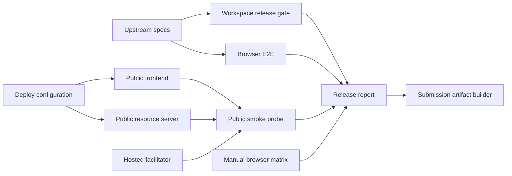
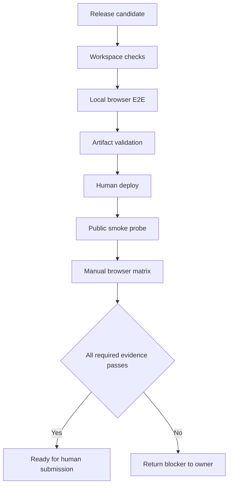
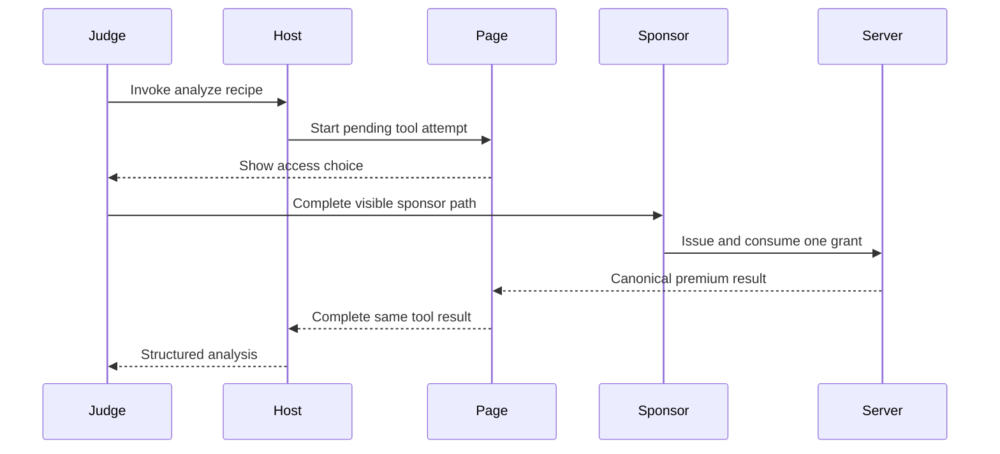

# Design Document

## Overview

`submission-readiness` は、上流5仕様を変更せず、一つの release candidate が審査可能かを検証して提出素材へ結び付ける release engineering slice である。workspace 内の build/test/static checks、ローカル browser E2E、公開 URL の smoke probe、手動 WebMCP/wallet matrix を段階化し、同じ commit SHA を README、検証記録、スクリーンショット、動画、Devpost 原稿へ伝播する。

本仕様は product runtime の新しい access behavior を所有しない。スポンサー経路、支払い経路、WebMCP orchestration、分析 contract に不具合が見つかった場合は該当上流境界へ修正を戻し、本仕様は release gate と回帰検証だけを更新する。外部サービスへの deploy、動画 upload、Devpost submit は人が実行し、自動化は準備状態の判定までに限定する。

### Goals

- 一コマンドで再現可能な workspace release gate と公開 smoke probe を提供する。
- sponsor-first golden path と Base Sepolia 支払い経路を自動・手動の適切な層で検証する。
- Origin Trial、CORS、x402 headers、preview bypass、secret leakage を release blocker として検出する。
- 英語 README、provenance、Devpost copy、3分未満の動画計画、提出 checklist を同じ release identity に揃える。

### Non-Goals

- 上流5仕様の contract、state、authorization、分析内容、UI flow の再設計。
- mainnet、production durability、multi-tenant operations、telemetry platform。
- Cloudflare、Node host、YouTube、Devpost、Git hosting への無人 deploy または submit。

## Boundary Commitments

### This Spec Owns

- workspace release command、CI gate、公開 URL smoke probe、および probe の typed result contract。
- browser E2E harness と manual compatibility matrix による既存 golden/failure path の検証。
- Cloudflare frontend と Node resource server の deploy manifest、environment examples、Origin Trial token 配置の release configuration。
- root README、architecture/provenance/deployment 文書、Devpost draft、demo script、screenshot manifest、submission checklist。
- release identity と検証証跡を関連付ける release report。

### Out of Boundary

- `adgate-contracts` の schema、fixture、error taxonomy、gate machine。
- `publisher-demo` の recipe、analyzer、preview handler。production で preview を無効化する構成確認だけを所有する。
- `sponsor-access` の modal、timer、grant ledger、authorization。
- `x402-payment-access` の policy、wallet、facilitator integration、receipt normalization。
- `webmcp-gated-tool` の host selection、tool registration、coordinator、visible gate experience。
- upstream blocker の局所修正、外部 deploy/upload/submit の実行。

### Allowed Dependencies

- 上流5仕様の public interfaces、routes、test suites、safe status だけを read-only の検証対象として利用する。
- pnpm workspace、Biome、TypeScript、Vitest、Playwright、Node native `fetch`、Git metadata を release tooling に利用できる。
- 公開 probe は `ADGATE_PUBLIC_APP_URL`、`ADGATE_PUBLIC_API_URL`、`ADGATE_FACILITATOR_URL`、`ADGATE_RELEASE_SHA` だけを入力とし、wallet secret または sponsor token を受け取らない。
- dependency direction は `Upstream artifacts -> Local release checks -> Browser E2E -> Public smoke -> Release report -> Submission artifacts` とし、submission tooling から production domain module への逆向き import を禁止する。

### Revalidation Triggers

- protected/preview/sponsor/health route、x402 header、CORS、error envelope の変更。
- WebMCP namespace、tool name/schema、Origin Trial 配布方法、browser support 手順の変更。
- Base Sepolia network、USDC asset、facilitator URL/capability、wallet confirmation flow の変更。
- frontend/server deploy target、environment variable、Node/pnpm version、build output の変更。
- judging criteria、必須提出 URL、動画時間・公開条件、締切の変更。

## Architecture

### Existing Architecture Analysis

- frontend は Cloudflare Workers 用 `wrangler.jsonc` と deploy script を持つが、starter 名・metadata のままで Origin Trial release validation がない。
- resource server は watch 用 `dev` script のみで、Node host 向けの deterministic build/start contract と deploy manifest がない。
- facilitator は build/start を持つが、公開提出では hosted Base Sepolia facilitator を既定とし、self-hosted service は local option に留める。
- upstream specs は app-local validators と tests を所有するため、本仕様は production source を複製せず、workspace scripts と black-box HTTP/browser checks から検証する。
- root README はリンクだけで、starter provenance、architecture、environment、judge path、license の説明を追加する必要がある。

### Architecture Pattern & Boundary Map



**Architecture Integration**:

- Selected pattern: staged release gate with black-box probes。product internalsを再実装せず、各境界の公開 contract を順番に検証する。
- Domain boundaries: automation は判定と証跡、deploy manifest は runtime 起動条件、submission pack は審査説明だけを所有する。
- Existing patterns preserved: pnpm filters、app-local tests、TypeScript/ESM、safe structured errors、explicit human consent。
- Build vs adopt: browser automation は Playwright、workspace execution は pnpm、HTTP probe は Node native fetch を採用し、custom browser driver や test dashboard は作らない。
- Simplification: release database、artifact server、deployment orchestrator を導入せず、JSON report と version-controlled Markdown を利用する。

### Technology Stack

| Layer | Choice / Version | Role in Feature | Notes |
|-------|------------------|-----------------|-------|
| Workspace validation | pnpm 11 / Biome 2 / TypeScript | build、lint、test の集約 | 既存 toolchain |
| Browser validation | Playwright current workspace version | local golden/failure path | fake WebMCP host と wallet port |
| Public validation | Node 24 native fetch | HTTPS、CORS、x402、Origin Trial、facilitator probe | secretless black-box check |
| Deployment | Cloudflare Workers / Render blueprint | frontend と Node server の起動契約 | hosted facilitator は外部依存 |
| Artifacts | Markdown / PNG or WebP / JSON | README、submission pack、release report | English submission content |

## File Structure Plan

### Directory Structure

```text
.
├── .github/workflows/
│   └── release-check.yml                 # pull request and frozen-candidate quality gate
├── docs/
│   ├── ARCHITECTURE.md                   # trust boundaries and end-to-end flow
│   ├── DEPLOYMENT.md                     # Cloudflare, Node host, env, rollback runbook
│   ├── PROVENANCE.md                     # starter baseline versus hackathon-period work
│   ├── release/
│   │   ├── MANUAL_TEST_MATRIX.md         # ChatGPT, Chrome, wallet, fallback evidence
│   │   └── RELEASE_CHECKLIST.md          # freeze, candidate, public smoke, sign-off
│   └── submission/
│       ├── content.json                   # typed project facts, copy, narration, and judging map
│       ├── DEVPOST.md                    # English submission copy and judging map
│       ├── DEMO_SCRIPT.md                # under-three-minute narration and shot list
│       ├── SUBMISSION_CHECKLIST.md        # final URLs, visibility, deadline, consent gate
│       └── screenshots/README.md          # required frames, filenames, capture metadata
├── scripts/release/
│   ├── contracts.ts                      # typed check result and release report contracts
│   ├── validateWorkspace.ts              # deterministic local command orchestration
│   ├── smokePublic.ts                    # public HTTPS and security boundary probes
│   ├── validateArtifacts.ts              # English links, duration, license, secret scan gates
│   ├── buildSubmissionArtifacts.ts       # typed content manifest to deterministic Markdown
│   ├── recordManualEvidence.ts            # validates and redacts human-supplied evidence
│   ├── evaluateReadiness.ts               # joins evidence without external submission
│   └── smokePublic.test.ts               # black-box response fixture tests
├── tests/e2e/
│   ├── fixtures/webmcpHost.ts            # document and navigator fake host adapters
│   ├── sponsor-golden-path.spec.ts        # pending tool through sponsor to shared result
│   └── failure-fallback.spec.ts           # unsupported host, wallet, abort, duplicate paths
├── playwright.config.ts                  # local frontend/server E2E lifecycle
└── render.yaml                           # Node resource server build/start and env declaration
```

### Modified Files

- `package.json` — read-only quality、E2E、artifact validation、public smoke、aggregate release scripts と Playwright dependency を追加する。
- `pnpm-lock.yaml` — release test dependency を固定する。
- `README.md` — AdGate value、architecture、judge path、setup、security、license、provenance、live links を英語で提示する。
- `apps/frontend/package.json` — deploy 前 check を production build と release metadata 検証へ接続する。
- `apps/frontend/index.html` — deployment origin に束縛された Origin Trial token の Vite build placeholder と AdGate metadata を持つ。
- `apps/frontend/wrangler.jsonc` — AdGate の公開 Worker identity と非秘密の runtime metadata を定義する。
- `apps/frontend/.env.example` — API URL、release SHA、Origin Trial token の公開/secret 区分を説明する。
- `apps/frontend/README.md` — starter 説明を AdGate frontend の local/WebMCP/browser test 手順へ更新する。
- `apps/server/package.json` — production build/start/typecheck/test script を追加する。
- `apps/server/tsconfig.json` — NodeNext ESM の reproducible build output を定義する。
- `apps/server/.env.example` — Base Sepolia policy、allowed origin、hosted facilitator、recipient の必須条件を網羅する。
- `apps/server/README.md` — resource server setup、health、CORS、x402、secret handling を英語で説明する。
- `apps/facilitator/.env.example` — optional local Base Sepolia facilitator の secret placeholder だけを定義する。
- `apps/facilitator/README.md` — optional local role と hosted default の違いを英語で説明する。
- `.gitignore` — local env、release report、recording source、temporary screenshots を除外し、curated submission images だけを許可する。

既存 upstream source file は release blocker 修正を除き変更しない。E2E fixture は public contract だけを通じて upstream behavior を駆動する。

## System Flows

### Staged release decision



自動 check は deploy や submit を開始しない。`PublicSmoke` は人が入力した候補 URL だけを read-only に確認し、`Manual` は実 wallet または browser permission が必要な項目の証跡を release report へ転記する。

### Judge golden path



支払いは第二の証跡として manual matrix と backup clip で確認する。審査員が wallet を持たない場合も sponsor path だけで中核価値を完了できる。

## Requirements Traceability

| Requirement | Summary | Components | Interfaces | Flows |
|-------------|---------|------------|------------|-------|
| 1.1–1.5 | deterministic workspace release gate | WorkspaceReleaseGate, ReleaseReporter | ReleaseCheck, ReleaseReport | Staged release decision |
| 2.1–2.2 | public HTTPS、CORS、x402 | PublicSmokeProbe | PublicEnvironment, ProbeResult | Staged release decision |
| 2.3 | Origin Trial verification | OriginTrialProbe | ProbeResult | Staged release decision |
| 2.4 | hosted facilitator capability | FacilitatorProbe | ProbeResult | Staged release decision |
| 2.5–2.6 | preview bypass と secret leakage | PublicSmokeProbe, ArtifactValidator | ProbeResult | Staged release decision |
| 3.1–3.2 | WebMCP/UI sponsor golden paths | BrowserE2EHarness | FakeModelContextPort | Judge golden path |
| 3.3 | Base Sepolia paid evidence | ManualCompatibilityMatrix, BrowserE2EHarness | ManualEvidence | Staged release decision |
| 3.4–3.5 | degraded and failure paths | BrowserE2EHarness, ManualCompatibilityMatrix | ManualEvidence | Staged release decision |
| 3.6 | non-automatable evidence | ManualCompatibilityMatrix | ManualEvidence | Staged release decision |
| 4.1–4.6 | English repository clarity and security | SubmissionArtifactBuilder, ArtifactValidator | ArtifactManifest | Staged release decision |
| 5.1–5.7 | Devpost、video、screenshots | SubmissionArtifactBuilder, FinalReadinessEvaluator | SubmissionManifest | Staged release decision |
| 6.1–6.4 | freeze、blocker、identity、deadline | ManualEvidenceRecorder, FinalReadinessEvaluator, ReleaseReporter | ReleaseReport | Staged release decision |
| 6.5 | explicit external-action consent | FinalReadinessEvaluator | SubmissionManifest | Staged release decision |

## Components and Interfaces

| Component | Domain/Layer | Intent | Req Coverage | Key Dependencies | Contracts |
|-----------|--------------|--------|--------------|------------------|-----------|
| WorkspaceReleaseGate | Release tooling | workspace checks を順序付きで実行 | 1.1–1.5 | pnpm P0, upstream tests P0 | Batch |
| ReleaseReporter | Release tooling | commit に束縛された secretless report を集約 | 1.2, 1.5, 6.2–6.4 | WorkspaceReleaseGate P0 | Service, State |
| PublicSmokeProbe | Public boundary | frontend/server HTTP contract を black-box 検証 | 2.1–2.2, 2.5–2.6 | public URLs P0 | Service, Batch |
| OriginTrialProbe | Browser boundary | deployed origin の Origin Trial 設定を確認 | 2.3 | PublicSmokeProbe P0 | Service |
| FacilitatorProbe | Payment operations | hosted facilitator の health/capability を確認 | 2.4 | facilitator P0 | Service |
| BrowserE2EHarness | Browser test | sponsor golden path と failure fallback を再現 | 3.1–3.5 | Playwright P0, upstream UI P0 | Batch |
| ManualCompatibilityMatrix | Release evidence | ChatGPT、Chrome、実 wallet の証跡を統一形式で記録 | 3.3–3.6 | public release P0 | State |
| ArtifactValidator | Release tooling | docs、links、license、secret markers、duration を検証 | 2.6, 4.1–4.6, 5.1–5.7 | Git P0, artifact files P0 | Service, Batch |
| SubmissionArtifactBuilder | Release tooling | typed content から repository/submission artifacts を決定的に生成 | 4.1–4.6, 5.1–5.7, 6.1–6.5 | ArtifactValidator P0 | Service, Batch |
| ManualEvidenceRecorder | Release tooling | human-supplied browser/wallet evidence を検証・redact | 3.3–3.6, 6.2–6.3 | ManualCompatibilityMatrix P0 | Service |
| FinalReadinessEvaluator | Release tooling | 自動・手動 evidence を結合し human submission の可否だけを判定 | 5.3–6.5 | ReleaseReporter P0 | Service, Batch |

### Release Tooling

#### WorkspaceReleaseGate and ReleaseReporter

| Field | Detail |
|-------|--------|
| Intent | 同じ commit の必須 check を fail-fast せず全件収集し、最終判定を返す |
| Requirements | 1.1–1.5, 6.2–6.4 |

**Contracts**: Service [x] / API [ ] / Event [ ] / Batch [x] / State [x]

```typescript
type ReleaseCheckStatus = "passed" | "failed" | "skipped";

interface ReleaseCheck {
  readonly id: string;
  readonly command: readonly string[];
  readonly required: boolean;
}

interface ReleaseCheckResult {
  readonly id: string;
  readonly status: ReleaseCheckStatus;
  readonly durationMs: number;
  readonly safeSummary: string;
}

interface ReleaseReport {
  readonly schemaVersion: 1;
  readonly releaseSha: string;
  readonly generatedAt: string;
  readonly ready: boolean;
  readonly checks: readonly ReleaseCheckResult[];
}
```

- command は shell string ではなく argv として起動し、secret-bearing environment を report へ写さない。
- required check は formatting/lint、各 app build/typecheck、全 unit/integration tests、browser E2E、artifact validation とする。
- report は `.artifacts/release/report.json` へ生成し Git 管理しない。提出文書には SHA と pass/fail のみを転記する。

##### Batch Contract

- Trigger: `pnpm release:check` または CI workflow。
- Input: checked-out commit と documented test environment。
- Output: process exit code と `ReleaseReport`。
- Idempotency: 同じ commit/config では chain、wallet、external deploy を呼ばず同じ check 集合を実行する。

#### PublicSmokeProbe, OriginTrialProbe, and FacilitatorProbe

```typescript
interface PublicEnvironment {
  readonly appUrl: URL;
  readonly apiUrl: URL;
  readonly facilitatorUrl: URL;
  readonly expectedReleaseSha: string;
}

type ProbeResult =
  | { readonly ok: true; readonly check: string; readonly evidence: string }
  | { readonly ok: false; readonly check: string; readonly blocker: string };

interface PublicProbe {
  run(environment: PublicEnvironment, signal: AbortSignal): Promise<readonly ProbeResult[]>;
}
```

- URL は HTTPS、明示 origin、認証情報なしに限定する。localhost は local smoke mode だけ許可する。
- resource probe は allowed origin の `OPTIONS`、未払い `POST` の402、exposed x402 headers、`Cache-Control: no-store`、Base Sepolia一条件を検査する。
- preview endpoint は `404` または明示的な非公開応答だけを合格とする。
- Origin Trial は page response header または `meta[http-equiv=origin-trial]` の非空値を確認し、manual matrix で対象 origin と browser の実認識を補完する。
- facilitator は timeout 付きで `/health` と `/supported` を読み、`exact` + `eip155:84532` を要求する。raw response は report に保存しない。

### Browser Validation

#### BrowserE2EHarness

fake host は `document.modelContext` と `navigator.modelContext` を同時・単独で注入でき、登録された `analyze_recipe` callback と AbortSignal を捕捉する。fixture は tool の production schema または coordinator を再定義せず、host port だけを模倣する。

E2E は次を必須にする。

- document 優先と navigator fallback、unsupported host の通常閲覧。
- tool Promise が sponsor view 中に pending で、完了後にページ結果と同じ canonical result を一度だけ返す。
- wallet unavailable/facilitator unavailable でも sponsor action が残る。
- duplicate tool/UI start、user cancel、host abort、late result が二重成功しない。
- payment panel は server-derived Base Sepolia 条件を表示し、human click 前に wallet method を呼ばない。

#### ManualCompatibilityMatrix

```typescript
type ManualEvidenceStatus = "pass" | "fail" | "blocked";

interface ManualEvidence {
  readonly environment: "chatgpt" | "chrome" | "base-sepolia-wallet";
  readonly releaseSha: string;
  readonly checkedAt: string;
  readonly status: ManualEvidenceStatus;
  readonly evidencePath: string;
  readonly safeNotes: string;
}
```

matrix は実行日、browser version、public URL、期待結果、screenshot/clip path を記録し、token、signature、full wallet address、seed を記録しない。`blocked` は release pass ではなく、スポンサー経路以外の必須項目なら blocker とする。

### Documentation and Submission

#### ArtifactValidator

validator は version-controlled manifest から必須 Markdown/画像と placeholder URL を検査する。root `LICENSE` と package metadata の MIT 表示、tracked `.env`/secret marker、English section、video duration 上限、release SHA 一致を機械判定する。一般文字列を secret と誤検出しないよう、known private-key/seed/token formats と tracked environment files に限定して走査する。

#### SubmissionArtifactBuilder, ManualEvidenceRecorder, and FinalReadinessEvaluator

`SubmissionArtifactBuilder` は strict schema で検証した `docs/submission/content.json` を唯一の narrative source とし、README の管理 section、architecture/provenance/deployment、Devpost copy、demo shot list、screenshot manifest、checklist を決定的に render する。生成物の直接編集は drift check で失敗させ、同じ value proposition と用語 (`AdGate`, `analyze_recipe`, `recipe_analysis`, `sponsor`, `Base Sepolia x402`) を全素材で維持する。

`ManualEvidenceRecorder` は人が別途実行した ChatGPT、Chrome、wallet check の JSON 入力を schema validation と redaction rule に通し、release SHA、status、safe notes、repository-relative evidence path だけを保存する。この component は browser 操作、wallet 操作、撮影、upload を開始しない。

`FinalReadinessEvaluator` は `ReleaseReport`、public probe、validated manual evidence、artifact manifest を読み、mandatory item が一つでも未完了なら blocked を返す。screenshot binary の取得と動画録画は人の作業であり、tool は filename、caption、release SHA、duration、public URL を検証するだけとする。publish/upload/submit 項目は常に human-only で、自動 command を持たない。

## Data Models

### Domain Model

- `ReleaseReport` は一 release candidate の自動検証集約で、`releaseSha` が identity root である。
- `ProbeResult` は一つの公開境界 check の secretless 証跡で、失敗は blocker を明示する。
- `ManualEvidence` は自動化できない browser/wallet check の記録であり、authorization evidence ではない。
- `SubmissionManifest` は URL、artifact path、release SHA、visibility check を束ねるが、外部 service credentials を保持しない。

### Data Contracts & Integration

```typescript
interface SubmissionManifest {
  readonly releaseSha: string;
  readonly liveAppUrl: string;
  readonly repositoryUrl: string;
  readonly videoUrl: string;
  readonly videoDurationSeconds: number;
  readonly screenshots: readonly string[];
  readonly finalApproval: "pending-human-approval" | "approved-by-human";
}
```

- URL は HTTPS とし、video URL は public visibility を人が確認する。
- `videoDurationSeconds < 180` を必須とする。
- `finalApproval` は default `pending-human-approval`。tooling が自動で approved へ変更しない。
- report と manifest は product authorization、payment evidence、sponsor token と無関係である。

## Error Handling

### Error Strategy

- local command failure: 全 required check を可能な範囲で収集し、非zero exit と安全な再実行 command を返す。
- public timeout/DNS/5xx: 対象 URL と check 名だけを blocker にし、response body 全体や header secret を保存しない。
- malformed x402/CORS/Origin Trial: release blocker。runtime を推測で合格にしない。
- external wallet/browser manual failure: `fail` または `blocked` として明示し、成功 clip で置換する場合も同じ release SHA を要求する。
- artifact placeholder、private repository、非公開 video、180秒以上: submission blocker。
- upstream behavior defect: owner spec と影響 check を記録し、release tooling 内に workaround を実装しない。

### Monitoring

公開 probe は check ID、status、duration、safe evidence のみを JSON report に記録する。HTTP authorization、payment signature、sponsor token、environment values、raw error body を記録しない。public endpoint の継続監視は提出前の明示実行に限定し、常駐監視サービスは作らない。

## Testing Strategy

### Unit Tests

- Public probe response fixture で HTTPS、CORS、exposed headers、no-store、単一 Base Sepolia challenge、preview 非公開の pass/fail を検証する (2.1–2.2, 2.5–2.6)。
- Origin Trial と facilitator parser が欠落、不正、wrong network/scheme、timeout を blocker にすることを検証する (2.3–2.4)。
- Artifact validator が license mismatch、tracked secret-like file、placeholder URL、179/180秒境界、release SHA mismatch を検出する (4.4–4.6, 5.3–5.7, 6.3)。
- Release reporter が required failure を `ready: false`、safe summary、nonzero exit へ変換することを検証する (1.1–1.5)。

### Integration Tests

- aggregate release command が upstream frontend/server/facilitator checks と artifact validation を呼び、一つの report を生成する (1.1–1.5)。
- local frontend/server を起動し、public probe と同じ HTTP assertion が health、402、CORS、preview 非公開へ通ることを検証する (2.1–2.6)。
- CI workflow が install、release check、E2E artifact upload を固定 Node/pnpm version で実行する (1.1–1.5, 6.1–6.3)。

### E2E/UI Tests

- fake WebMCP host から sponsor golden path を完了し、pending invocation、visible status、page result、tool result の一致を検証する (3.1–3.2)。
- wallet/provider unavailable と payment readiness failure で sponsor path が維持され、安全な案内が出ることを検証する (3.4)。
- cancel、host abort、duplicate start、expired sponsor outcome、wrong payment network が成功へ遷移しないことを検証する (3.5)。
- human click 前に wallet method が呼ばれず、Base Sepolia receipt が表示される支払い harness を検証する (3.3)。

### Manual Release Tests

- ChatGPT in-app browser の `document.modelContext` で tool discovery、pending sponsor choice、same invocation completion を記録する (3.1, 3.6)。
- WebMCP-enabled Chrome の fallback namespace で同じ sponsor path と registration cleanup を記録する (3.1, 3.6)。
- injected wallet で Base Sepolia testnet USDC の明示署名と settlement receipt を記録し、拒否時の sponsor fallback も確認する (3.3–3.6)。
- public URL、repository、YouTube visibility、English copy、screenshot captions、締切を二名または二回の独立確認で sign off する (5.1–6.5)。

## Security Considerations

- release scripts は payer/facilitator private key を入力に取らず、実支払いを自動実行しない。
- public probe は read-only health/options/unpaid challenge だけを利用し、sponsor token を発行・消費しない。
- `.env`、recording source、wallet data、raw reports は Git ignore 対象とし、example は placeholder だけを持つ。
- screenshots/video は wallet address、browser profile、API secret、通知、個人情報を crop または redact してから公開する。
- Origin Trial token は origin-bound public metadata であり secret と誤記しない。wallet/facilitator secrets とは明確に区別する。

## Performance & Reliability

- public HTTP probe は各 request に短い timeout と全体 deadline を持ち、retry は idempotent な GET/OPTIONS/unpaid challenge に限定する。
- browser E2E は fake clock/ports を用い、実 countdown、wallet、chain の速度に依存しない。
- golden demo は sponsor path を主経路、成功済み Base Sepolia clip を paid-path backup とし、三分枠内で外部障害から切り替えられる構成にする。
