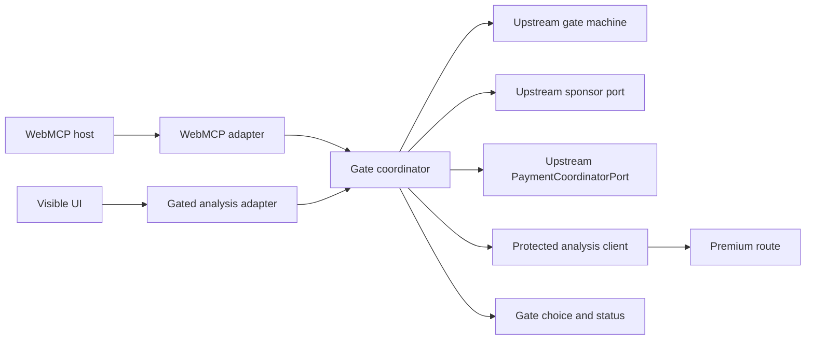
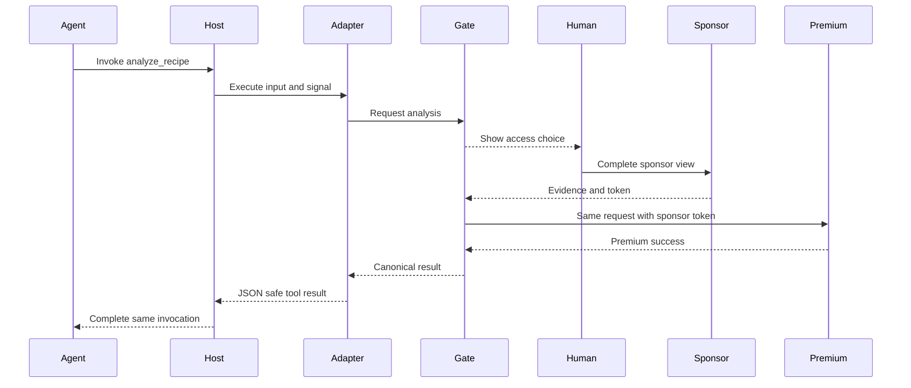
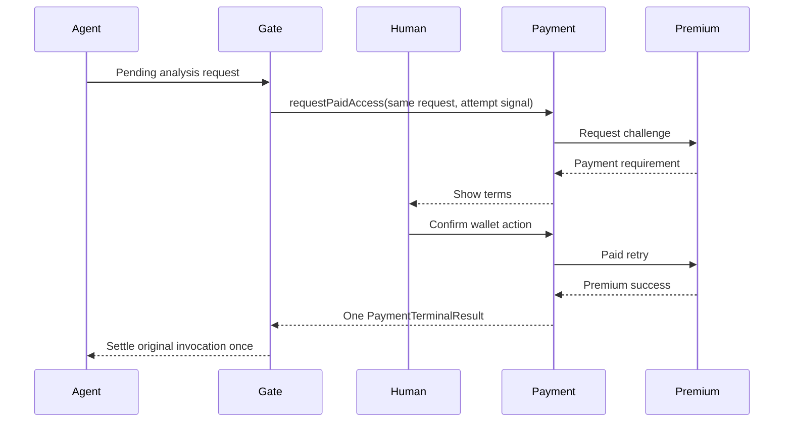

# Design Document

## Overview

`webmcp-gated-tool` は publisher の `recipe_analysis` を `analyze_recipe` として公開し、WebMCP callback の Promise を人間の選択が終わるまで保持する frontend integration slice である。単一の `GateCoordinator` が WebMCP と可視 UI の両方から同じ `RecipeAnalysisInput` を受け、upstream `GateMachine` を進行させ、`SponsorGatePort` または `PaymentCoordinatorPort.requestPaidAccess` の終端結果から同じ `WebMCPToolResult` を返す。

WebMCP adapter は `document.modelContext` を優先し、旧 Chrome 互換の `navigator.modelContext` を fallback として feature-detect する。登録 lifetime と呼出 lifetime は別の `AbortSignal` とし、現行 draft の `execute(input, { signal })` を coordinator の attempt signal へ結合する。tool は cross-origin へ公開せず、静的 description、strict JSON Schema、`untrustedContentHint: true` を使用する。

### Goals

- エージェント呼出と可視 UI を一つの gate coordinator・state machine・protected resource path へ統合する。
- sponsor と payment の人間確認が終わるまで同じ tool Promise を安全に待機させる。
- host abort、unmount、重複実行、遅延結果を一度だけ終端させる。
- draft API の `document` 優先、`navigator` fallback、JSON-safe result を互換性 test で固定する。

### Non-Goals

- sponsor grant、wallet/x402、分析ロジック、canonical contract の再実装。
- server route、facilitator、CORS、deployment、Origin Trial token の構成。
- 複数 tool、queue、headless invocation、autonomous payment、cross-origin `exposedTo`。

## Boundary Commitments

### This Spec Owns

- 一回の分析試行を作り、upstream `GateMachine` と二つの access port を進行させる `GateCoordinator`。
- sponsor token を用いて canonical protected endpoint を呼ぶ薄い `ProtectedAnalysisClient`。
- `analyze_recipe` definition、WebMCP host selection、登録/解除、callback signal の伝播。
- gate choice/status の top-level composition、UI 用 analysis adapter、WebMCP availability status。
- WebMCP/gate integration 固有の unit、component、browser-contract tests。

### Out of Boundary

- `adgate-contracts`: `GateState`、`GateEvent`、`PremiumAnalysisRequest`、`WebMCPToolResult`、error taxonomy。
- `publisher-demo`: `PublishedRecipe`、`PublisherDemo`、`AnalysisPanel`、`DeterministicAnalyzer`。
- `sponsor-access`: `SponsorGatePort`、`SponsorModal`、grant issue/token/consume policy。
- `x402-payment-access`: `PaymentCoordinatorPort`、`PaymentTerminalResult`、`PaymentPanel`、wallet consent、paid retry、settlement、および payment 内部の exactly-once completion latch。
- `submission-readiness`: production preview removal、Origin Trial、公開 deployment、E2E release verification。

### Allowed Dependencies

- `GateCoordinator` は frontend `contracts.ts` と `gateMachine.ts`、`SponsorGatePort`、上流の `PaymentCoordinatorPort`、`ProtectedAnalysisClient` port のみに依存する。支払い開始には正規の `requestPaidAccess(request, signal)` だけを使い、payment の terminal union を再定義しない。
- `useWebMCPTools` は `GateCoordinatorPort` と frontend contract の schema/result normalizer のみに依存し、sponsor/payment 実装を直接 import しない。
- `App.tsx` だけが publisher、gate experience、sponsor provider、payment panel、WebMCP hook を composition する。
- dependency direction は `adgate contracts → upstream access ports → protected client → gate coordinator → WebMCP/UI adapters → App composition` とし、逆向き import と frontend/server runtime import を禁止する。
- WebMCP runtime には native API を採用し、新しい polyfill/runtime dependency を追加しない。

### Revalidation Triggers

- `GateState`、`GateEvent`、`PremiumAnalysisRequest`、`WebMCPToolResult`、`SponsorFlowResult`、`PaymentCoordinatorPort`、`PaymentTerminalResult`、`PaymentFlowState` の shape 変更。
- WebMCP の entry point、`registerTool` options、execute callback options、result serialization、tool name/schema 制約の変更。
- sponsor token と request nonce の binding、protected endpoint/header、payment terminal result の変更。
- `PublisherDemoProps.analysisClient` または top-level frontend composition ownership の変更。
- active attempt policy を reject から queue へ変える要求、または複数 premium tool の追加。

## Architecture

### Existing Architecture Analysis

- 現在の `useWebMCPTools.ts` は todo action の closure ごとに四 tool を一括登録し、`document.modelContext` のみを扱う。登録用 `AbortController` cleanup は再利用するが、tool 数、schema、callback、status を置換する。
- `webmcp.d.ts` は callback options と `Navigator.modelContext` を持たない。現行 draft の `ToolExecuteCallbackOptions.signal` と legacy fallback を型へ追加する。
- upstream は browser contracts/gate machine、publisher analyzer、sponsor port、payment coordinator を別々に所有する。本仕様は新しい業務 state を定義せず、それらを一つの attempt lifetime へ composition する。
- `PublisherDemo` は `AnalysisClientPort` を注入可能であるため、直接 preview 実行を変更せず `GatedAnalysisAdapter` を渡せる。

### Architecture Pattern & Boundary Map



**Architecture Integration**:

- Selected pattern: single-flight application coordinator with upstream ports。Promise completion、attempt identity、abort fan-out を一箇所へ集約する。
- Domain boundaries: coordinator は orchestration のみ、各 access port は自身の consent/authorization、premium service は分析を所有する。
- Existing patterns preserved: React lifecycle cleanup、Zod-derived JSON Schema、injected ports、discriminated unions、app-local imports。
- Build vs adopt: WebMCP registration/cancellation と Abort API は native draft を採用し、gate coordination のみを project-specific に実装する。
- Simplification: queue、event bus、global store、WebMCP wrapper package を導入せず、一 active attempt と一 React provider に限定する。

### Technology Stack

| Layer | Choice / Version | Role in Feature | Notes |
|-------|------------------|-----------------|-------|
| Frontend | React 19.2 / TypeScript 6 | provider、hook、gate/status composition | 既存 stack |
| Validation | Zod 4.4 / JSON Schema draft-07 | tool input と result の runtime boundary | upstream schema を再利用 |
| Browser API | WebMCP CG draft / Abort API | registration、execution、cancellation | `document` 優先、legacy `navigator` fallback |
| Tests | Vitest 4.1 / Testing Library 16.3 / jsdom | coordinator、host、UI lifecycle | fake ports と deferred Promise |

## File Structure Plan

### Directory Structure

```text
apps/frontend/src/
├── adgate/
│   ├── gateCoordinator.ts          # single active attempt と二経路 orchestration
│   ├── gateCoordinator.test.ts     # state、race、abort、late result tests
│   ├── protectedAnalysisClient.ts  # sponsor authorization 付き protected request
│   ├── protectedAnalysisClient.test.ts
│   ├── GateProvider.tsx            # coordinator snapshot と request port の React lifetime
│   ├── GateExperience.tsx          # choice、upstream panels、status の accessible host
│   └── GateExperience.test.tsx
├── useWebMCPTools.ts               # analyze_recipe の選択・登録・実行 adapter
├── useWebMCPTools.test.tsx         # document、navigator、cleanup、abort contract tests
└── webmcp.d.ts                     # current callback options と legacy namespace types
```

### Modified Files

- `apps/frontend/src/App.tsx` — `GateProvider` を top-level で composition し、`PublisherDemo` へ gated `AnalysisClientPort` を注入し、`GateExperience` と WebMCP status を配置する。
- `apps/frontend/src/App.test.tsx` — todo-specific WebMCP assertions を publisher/gate integration smoke test へ置換する。
- `apps/frontend/src/useWebMCPTools.ts` — todo tool 群を単一 `analyze_recipe` definition と host adapter に置換する。
- `apps/frontend/src/webmcp.d.ts` — `ToolExecuteCallbackOptions`、`Navigator.modelContext`、host result shape を unsafe cast なしで表現する。

`PublisherDemo.tsx`、upstream sponsor/payment modules、server files は変更しない。`App.tsx` は既存の composition-root ownership に限って変更する。

## System Flows

### WebMCP sponsor path



### WebMCP payment path



### Cancellation and race handling

registration signal は tool の登録 lifetime だけを所有する。各 execute callback の `options.signal` と provider-unmount signal は attempt-scoped controller へ結合し、その signal を `requestPaidAccess` へ同一参照で渡す。payment coordinator は success/error/cancelled の最初の一件で自身の Promise を exactly once に settle する。さらに GateCoordinator の completion latch は sponsor 終端、`PaymentTerminalResult`、host abort、user cancel の最初の一件だけで元の WebMCP invocation を settle し、その後の sponsor response、payment terminal result、fetch resolution は attempt ID と latch の両方で破棄する。

## Requirements Traceability

| Requirement | Summary | Components | Interfaces | Flows |
| 1.1–1.5 | 単一 tool、静的 metadata、strict input | WebMCPAdapter | WebMCPTool, RecipeAnalysisInput | Tool registration |
| 2.1–2.6 | namespace selection、single registration、cleanup/status | ModelContextSelector, WebMCPAdapter, GateProvider | ModelContextPort, WebMCPToolsState | Registration lifecycle |
| 3.1–3.2 | gate start と pending invocation | GateCoordinator, GateExperience | GateCoordinatorPort, GateSnapshot | 両 access flow |
| 3.3 | sponsor completion と protected execution | GateCoordinator, ProtectedAnalysisClient | SponsorGatePort, ProtectedAnalysisClientPort | WebMCP sponsor path |
| 3.4 | 正規 payment bridge と同一 invocation の exactly-once 終端 | GateCoordinator | PaymentCoordinatorPort, PaymentTerminalResult | WebMCP payment path |
| 3.5–3.6 | canonical result と upstream responsibility | GateCoordinator, WebMCPAdapter | WebMCPToolResult | 両 access flow |
| 4.1–4.5 | single-flight、identity、late result isolation | GateCoordinator | GatedAnalysisAttempt, CompletionLatch | Cancellation and race handling |
| 5.1–5.3 | human/host/unmount abort | GateCoordinator, GateProvider, WebMCPAdapter | AbortSignal | Cancellation and race handling |
| 5.4–5.6 | safe dependency failure と sponsor fallback | GateCoordinator, GateExperience | AdGateError, GateSnapshot | 両 access flow |
| 6.1, 6.6 | visible accessible status | GateExperience | GateExperienceProps | 両 access flow |
| 6.2–6.5 | JSON-safe success/error と untrusted data | WebMCPAdapter | WebMCPToolResult | Tool completion |

## Components and Interfaces

| Component | Domain/Layer | Intent | Req Coverage | Key Dependencies | Contracts |
|-----------|--------------|--------|--------------|------------------|-----------|
| GateCoordinator | Browser application | one attempt の identity、state、二経路、completion を所有 | 3.1–5.6, 6.2–6.5 | GateMachine P0, access ports P0 | Service, Event, State |
| ProtectedAnalysisClient | Browser HTTP | sponsor token で canonical premium request を実行 | 3.3, 4.3, 5.2–5.5 | FrontendContracts P0, fetch P0 | Service, API |
| ModelContextSelector | Browser boundary | `document` 優先で一つの host を選択 | 2.1–2.3 | browser globals P0 | Service |
| WebMCPAdapter | Browser boundary | tool definition、registration、callback/result bridge | 1.1–2.6, 5.2–5.5, 6.2–6.5 | GateCoordinator P0 | Service, API |
| GateProvider | React adapter | coordinator lifetime と app consumer port を提供 | 2.5, 3.1–5.3 | GateCoordinator P0 | Service, State |
| GateExperience | React UI | choice、upstream panels、safe status を表示 | 3.1–3.5, 5.1, 5.4–6.1, 6.6 | GateProvider P0 | State |
| GatedAnalysisAdapter | React integration | visible CTA を同じ coordinator へ接続 | 3.1–4.5 | GateCoordinator P0 | Service |

### Browser Application

#### GateCoordinator

| Field | Detail |
|-------|--------|
| Intent | WebMCP/UI の一要求を upstream gate と access ports へ結合し、一終端値を返す |
| Requirements | 3.1–5.6, 6.2–6.5 |

**Responsibilities & Constraints**

- active attemptは最大一件。二件目は既存attemptに触れずretryableな`INVALID_TRANSITION`と安全なbusy messageを返し、visible CTAはdisabledにする。
- `PremiumAnalysisRequest` を開始時に一度作り、`nonce` は同じ `requestId` とする。これにより upstream sponsor binding を canonical body の `requestId` へ対応させ、契約 field を追加しない。
- state 変更は upstream `transitionGate` の event だけで行い、独自 `GateState` を定義しない。
- sponsor successは`ProtectedAnalysisClient`、paymentはupstream `requestPaidAccess`が返す`PaymentTerminalResult`を正規化する。payment successのreceiptはmemory-only page stateへ渡し、WebMCP結果には含めない。
- payment coordinator 自身の exactly-once terminal semantics を前提としつつ、GateCoordinator の completion latch も sponsor/payment/abort/cancel の最初の一件だけを元の WebMCP Promise へ反映する。

**Dependencies**

- Outbound: `transitionGate` — canonical state transition (P0)
- Outbound: `SponsorGatePort` — sponsor human flow (P0)
- Outbound: `PaymentCoordinatorPort.requestPaidAccess(request, signal)` — payment human flow の正規 bridge (P0)
- Outbound: `ProtectedAnalysisClientPort` — sponsor-authorized analysis (P0)
- Inbound: WebMCPAdapter / GatedAnalysisAdapter — invocation (P0)

`sponsorId` は composition root が `GateCoordinator` の生成時に注入し、coordinator は sponsor の具体契約を import しない。API base URL も composition root が `VITE_API_BASE_URL`（未指定時は same-origin）から一度だけ解決し、sponsor、challenge、payment、protected analysis の各 client へ同じ値を渡す。

**Contracts**: Service [x] / API [ ] / Event [x] / Batch [ ] / State [x]

```typescript
type InvocationSource = "webmcp" | "visible_ui";

interface GatedAnalysisAttempt {
  attemptId: string;
  nonce: string;
  request: PremiumAnalysisRequest;
  source: InvocationSource;
}

interface GateSnapshot {
  state: GateState;
  source?: InvocationSource;
  paymentAvailable: boolean;
}

interface GateCoordinatorPort {
  requestAnalysis(
    input: RecipeAnalysisInput,
    options: { source: InvocationSource; signal?: AbortSignal },
  ): Promise<WebMCPToolResult>;
  chooseSponsor(): Promise<void>;
  choosePayment(): Promise<void>;
  cancel(reason: "user" | "abort" | "unmounted"): void;
  getSnapshot(): GateSnapshot;
  subscribe(listener: (snapshot: GateSnapshot) => void): () => void;
}

// Imported verbatim from x402-payment-access; this spec does not own these types.
type PaymentTerminalResult =
  | { type: "success"; result: PremiumAnalysisSuccess; receipt: PaymentReceipt }
  | { type: "error"; error: AdGateError }
  | { type: "cancelled"; reason: "user" | "abort" | "unmounted" };

interface PaymentCoordinatorPort {
  requestPaidAccess(
    request: PremiumAnalysisRequest,
    signal?: AbortSignal,
  ): Promise<PaymentTerminalResult>;
  confirm(provider: Eip1193ProviderPort): Promise<void>;
  cancel(reason: "user" | "abort" | "unmounted"): void;
  getSnapshot(): PaymentFlowState;
  subscribe(listener: (state: PaymentFlowState) => void): () => void;
}
```

- Preconditions: input は frontend `RecipeAnalysisInput` schema で parse 済み。
- Postconditions: returned value は upstream `normalizeWebMCPResult` が生成した JSON-safe union。
- Invariants: 一 attempt の request、nonce、source は immutable。`choosePayment()` は active request と attempt signal で `requestPaidAccess` を一度だけ呼び、`confirm` は呼ばない。payment terminal Promise と元の WebMCP invocation はそれぞれ一度だけ settle する。

##### Event Contract

- Published: `GateSnapshot`。同期 snapshot 後の変化だけを subscriber へ通知する。
- Subscribed: sponsor result、`PaymentTerminalResult`、user choice、AbortSignal。payment snapshot は x402 所有の `ActivePaymentPanel` が表示専用に購読し、GateCoordinator と WebMCP invocation の終端判定には使用しない。
- Ordering: attempt IDが一致するeventのみを受理する。payment successは`payment_succeeded`で`awaiting_payment`から`succeeded`へ原子的に遷移し、終端後のdeliveryは破棄する。

##### State Management

- State model: upstream `GateState` + immutable attempt metadata。
- Persistence: browser memory のみ。reload を越えない。
- Concurrency: single-flight reject policy + attempt ID + completion latch。

#### ProtectedAnalysisClient

| Field | Detail |
|-------|--------|
| Intent | sponsor capability を canonical protected endpoint へ一度だけ提示する |
| Requirements | 3.3, 4.3, 5.2–5.5 |

**Contracts**: Service [x] / API [x] / Event [ ] / Batch [ ] / State [ ]

```typescript
interface ProtectedAnalysisClientPort {
  executeWithSponsor(input: {
    request: PremiumAnalysisRequest;
    token: string;
    signal: AbortSignal;
  }): Promise<PremiumAnalysisSuccess | AdGateErrorEnvelope>;
}
```

| Method | Endpoint | Request | Response | Errors |
|--------|----------|---------|----------|--------|
| POST | `/api/recipe-analysis` | `PremiumAnalysisRequest`, matching `Idempotency-Key`, `Authorization: Sponsor <token>` | `200 PremiumAnalysisSuccess` | canonical `AdGateErrorEnvelope` |

client は `request.requestId` を sponsor nonce binding として扱う。token を state snapshot、URL、storage、log、result に含めず、response body を frontend contract で strict parse する。

### WebMCP Boundary

#### ModelContextSelector and WebMCPAdapter

| Field | Detail |
|-------|--------|
| Intent | 一つの supported host へ tool を登録し、invoke/cancel/result を coordinator へ bridge する |
| Requirements | 1.1–2.6, 5.2–5.5, 6.2–6.5 |

**Contracts**: Service [x] / API [x] / Event [ ] / Batch [ ] / State [ ]

```typescript
interface ToolExecuteCallbackOptions {
  readonly signal: AbortSignal;
}

interface ModelContextTool {
  name: "analyze_recipe";
  title: string;
  description: string;
  inputSchema: object;
  annotations: {
    readOnlyHint: false;
    untrustedContentHint: true;
  };
  execute(
    input: unknown,
    options: ToolExecuteCallbackOptions,
  ): Promise<WebMCPToolResult>;
}

interface ModelContextPort {
  registerTool(
    tool: ModelContextTool,
    options: { signal: AbortSignal },
  ): Promise<void>;
}

type ModelContextSelection =
  | { supported: true; source: "document" | "navigator"; context: ModelContextPort }
  | { supported: false };
```

- selector は `document.modelContext`、次に `navigator.modelContext` を確認し、両方存在しても一つだけ返す。
- input schema は upstream Zod schema から draft-07 JSON Schema を生成し、root に `additionalProperties: false` があることを contract test する。
- registration controller abort は tool unregister、execute options signal は active attempt abort として別々に扱う。
- registration options に `exposedTo` を渡さず、同一 page と browser agent の既定 exposure に限定する。
- registration `SecurityError`、`NotAllowedError`、`InvalidStateError` は raw DOMException を表示せず unavailable status へ変換する。

### React Integration

#### GateProvider and GatedAnalysisAdapter

`GateProvider` は coordinator instance を一つだけ作り、`useSyncExternalStore` 相当の snapshot 購読を React へ公開する。unmount cleanup は subscription を解除し、`cancel("unmounted")` を呼ぶ。

```typescript
interface GatedAnalysisClient extends AnalysisClientPort {
  analyze(input: RecipeAnalysisInput, signal?: AbortSignal): Promise<RecipeAnalysisResult>;
}
```

adapter は visible UI source で `requestAnalysis` を呼び、success の `data` を返す。失敗 union は safe `AdGateError` を持つ typed failure へ変換し、`PublisherDemo` の既存 error state を再利用する。

#### GateExperience

`awaiting_choice` で sponsor/payment の明示 button を表示し、upstream `SponsorModal` と x402 所有の表示専用 `ActivePaymentPanel` を必要な state だけで配置する。通常の `PaymentPanel` は自ら attempt を開始・cleanup し、`ActivePaymentPanel` は GateCoordinator が開始した同じ coordinator を購読するだけで、架空 request や counterfeit port を作らない。status は `aria-live="polite"` を使用し、choice dialog の focus management は sponsor/payment upstream component に委譲する。payment unavailable では payment button を無効化して理由を表示するが sponsor button は維持する。

## Data Models

### Domain Model

- `GatedAnalysisAttempt` は browser-local orchestration aggregate。`attemptId`、request identity、nonce、source を束ねる。
- `GateState`、`AccessEvidence`、`PremiumAnalysisSuccess`、`WebMCPToolResult` は upstream immutable value object であり、本仕様は field を追加しない。
- `WebMCPToolsState` は registration status だけを表し、gate business state を重複保持しない。

### Data Contracts & Integration

- tool inputはunknownからupstream Zod schemaへparseし、固定recipe IDと任意dietary goalsだけを受理する。recipe title/ingredients/instructionsとunknown keyは拒否する。
- host result は upstream `WebMCPToolResult` の plain JSON value とし、WebMCP runtime の serialization に委譲する。MCP `content` wrapper を独自に付加しない。
- external recipe/result は `untrustedContentHint: true` と構造化 field により data として扱う。description は compile-time constant のみ。
- sponsor token、payment signature/provider data、Abort reason の raw value は public result に含めない。

## Error Handling

### Error Strategy

- invalid input: `INVALID_INPUT` を即時返し、attempt を作らない。
- concurrent request / invalid user choice: `INVALID_TRANSITION`、existing attempt を維持する。
- human/host/unmount abort: `CANCELLED` に正規化し、全 child controller と subscription を cleanup する。
- sponsor/payment/resource unavailable: upstream `DEPENDENCY_UNAVAILABLE` を保持し、raw cause を捨てる。
- invalid/expired/reused evidence、idempotency conflict: upstream code を保持し、自動で別経路または再署名へ切り替えない。
- unknown/registration error: `INTERNAL_ERROR` または unavailable status。stack、token、signature、provider/facilitator body は非公開。

### Monitoring

browser console へ token、recipe body、payment payload、raw error を出力しない。UI は host source、registration state、safe error code、gate phase のみを表示できる。production telemetry は `submission-readiness` の責務とする。

## Testing Strategy

### Unit Tests

- `GateCoordinator`: valid start から各 canonical transition、二件目 reject、attempt identity/nonce=requestId、terminal reset を検証する (3.1–4.5)。
- `GateCoordinator`: sponsor success の一回 protected call、`requestPaidAccess` の一回呼出し、`PaymentTerminalResult` の success/error/cancelled mapping を検証する (3.3–3.6, 5.1–5.6)。
- race harness: abort と成功の競合、unmount、late sponsor/payment/fetch resolution が completion/state または元の WebMCP invocation を二重 settle しないことを検証する (4.4–5.3)。
- `ProtectedAnalysisClient`: header/body identity、strict success/error parse、abort、token 非露出を検証する (3.3, 4.3, 5.2–5.5)。

### Integration Tests

- fake sponsor port と protected client で tool Promise が sponsor 完了まで pending、その後 canonical success になることを検証する (3.1–3.5)。
- fake `PaymentCoordinatorPort` で `requestPaidAccess` が challenge/confirm 中は pending、各 canonical terminal result が同じ invocation を exactly once に完了することを検証する (3.1–3.5, 4.5, 5.1–5.3)。
- document と navigator の両方、navigator のみ、unsupported、registration rejection、abort cleanup を検証する (2.1–2.6)。
- execute callback の signal abort が gate、sponsor/payment、fetch へ一回伝播し、tool が safe cancellation で終わることを検証する (5.1–5.3)。

### E2E/UI Tests

- WebMCP tool invocation で page が `awaiting_choice` を announce し、sponsor を完了すると result panel と tool result が同じ内容になることを検証する (3.1–3.5, 6.1–6.6)。
- payment 選択から確認 panel、進行 status、成功 receipt、result までの表示を fake ports で検証する (3.4–3.5, 6.1–6.6)。
- active gate 中の二回目 tool/UI click が既存 dialog を上書きせず、二件目だけ `INVALID_TRANSITION` になることを検証する (4.1–4.2)。
- unsupported WebMCP でも publisher と visible gated CTA が動作し、安全な案内だけが表示されることを検証する (2.3, 6.1, 6.6)。

## Security Considerations

- wallet method は upstream `PaymentPanel` の human click だけが開始する。tool callback、gate start、mount から `confirm` を自動呼出ししない。
- `inputSchema` は unknown field を拒否し、tool description に runtime content を入れず、external result を untrusted と注記する。
- WebMCP registration は既定の same-page/browser-agent exposure のみを使い、cross-origin `exposedTo` を設定しない。
- sponsor token と payment transient data は attempt-scoped memory に限定し、terminal/abort 直後に参照を解放する。
- draft API 変更は型と browser-contract test を先に更新し、unsafe cast や `any` による互換性吸収を禁止する。

## Performance & Scalability

- active attempt は一件、access operation と premium request は各一件だけ in-flight とする。
- snapshot notification は canonical state transition ごとに一回とし、countdown の高頻度 state を coordinator へ複製しない。
- queue、永続 state、multi-tab coordination は導入しない。複数同時試行が必要になった時点で roadmap の再分解を要求する。

## Supporting References

- [WebMCP Community Group draft](https://webmachinelearning.github.io/webmcp/) — `document.modelContext`、register/execute callback、AbortSignal、serialization の標準面。
- [WebMCP explainer](https://github.com/webmachinelearning/webmcp/blob/main/README.md) — imperative registration、signal による lifecycle、permissions/exposure の利用例。
- [Chrome WebMCP guidance](https://developer.chrome.com/docs/ai/agents) — human-in-the-loop と imperative tool の browser integration。
