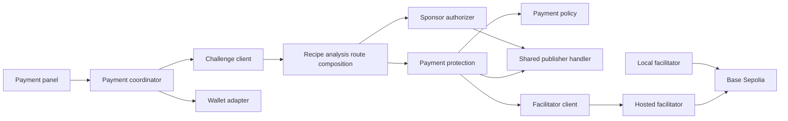
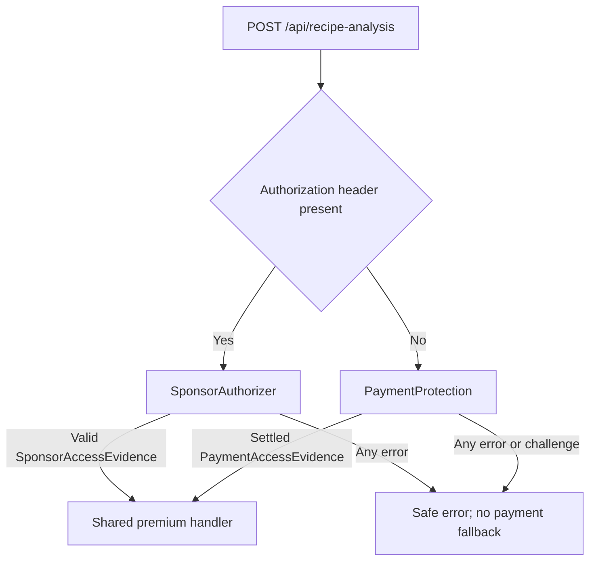
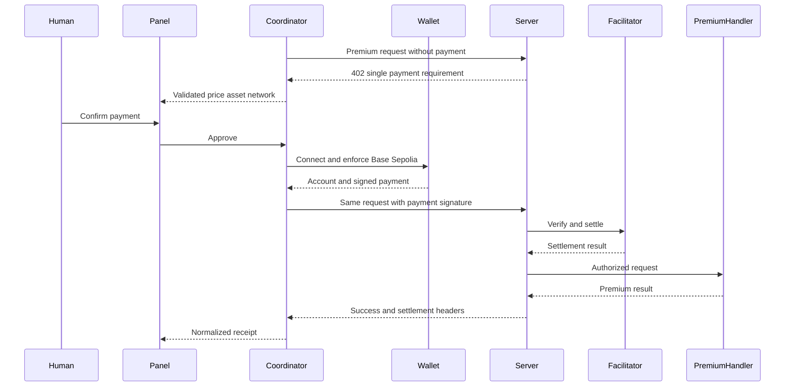
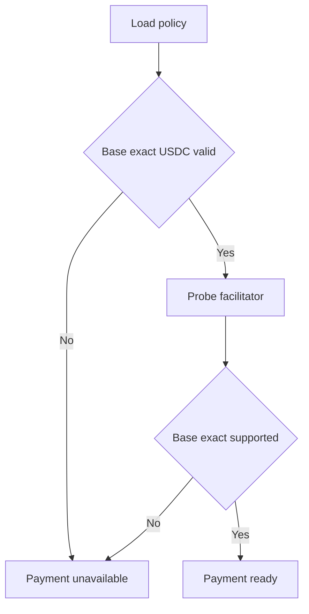

# Design Document

## Overview

本機能は、`POST /api/recipe-analysis` の canonical server composition を所有し、`Authorization` header がある要求は `SponsorAuthorizer`、ない要求は Base Sepolia x402 `exact` の `PaymentProtection` へ排他的に振り分ける。両経路は同じ premium handler だけへ委譲する。browser では注入ウォレットによる明示確認から同一プレミアム要求の支払い付き再試行までを提供し、WebMCP gate には exactly-once terminal bridge を公開する。リソースサービスの payment policy を唯一の設定源とし、frontend は 402 challenge を厳格に検証して表示するため、価格・asset・network を二重管理しない。

設計は三つの trust boundary を維持する。resource server は challenge と保護を所有し、browser は wallet consent と支払い付き再試行を所有し、facilitator は verify/settle 能力だけを提供する。`adgate-contracts` の `PremiumAnalysisRequest`、`PremiumAnalysisSuccess`、`PaymentAccessEvidence`、`AdGateErrorEnvelope` を変更せず利用し、分析生成、スポンサー、WebMCP lifecycle は吸収しない。

### Goals

- Base Sepolia `eip155:84532`、`exact`、testnet USDC の単一支払い経路を確立する。
- 402 challenge を server-authoritative にし、署名前の人間確認と安全な再試行を保証する。
- CORS、no-store、error sanitization、idempotency により公開デモで安全に動かす。
- hosted facilitator を既定経路とし、mock による再現可能な integration test を提供する。

### Non-Goals

- 他 chain、mainnet、複数 asset、`upto` scheme、fiat、custodial wallet。
- sponsor grant、premium analysis の生成、WebMCP tool lifecycle。
- browser private key、production accounting、支払い履歴 DB。
- self-hosted facilitator の deployment 自動化。既存 facilitator は Base Sepolia `exact` 互換の local option としてのみ整理する。

## Boundary Commitments

### This Spec Owns

- server の `recipe_analysis` x402 payment policy、payment middleware adapter、支払い用 CORS/no-store policy。
- `POST /api/recipe-analysis` の最終 composition、スポンサー優先の排他的分岐、共有 premium handler への委譲、および fail-closed behavior。
- publisher の preview router を非 production の明示 opt-in 時だけ mount し、production では常に非公開にする policy。
- frontend の 402 challenge parser、EIP-1193 wallet adapter、支払い coordinator、確認・状態表示 UI。
- WebMCP gate が消費する `PaymentCoordinatorPort.requestPaidAccess` と exactly-once success/error/cancel terminal contract。
- facilitator が Base Sepolia `exact` を扱えるかを判定する readiness probe と、local facilitator の Base-only registration。
- 支払い付き再試行、idempotency 維持、settlement receipt の `PaymentAccessEvidence` 正規化。

### Out of Boundary

- `adgate-contracts`: canonical request/result/evidence/error field と gate state/event。
- `publisher-demo`: `RecipeAnalysisService` と premium handler の分析結果生成。
- `sponsor-access`: sponsor UI、grant 発行・消費、および ledger。
- `webmcp-gated-tool`: tool registration、二経路の browser orchestration、および本仕様の terminal result から WebMCP result への変換。
- `submission-readiness`: production deploy、Origin Trial、録画 fallback、preview 非公開を含む提出検証。preview mounting の実装は所有しない。

### Allowed Dependencies

- frontend と server は各 app の `adgate/contracts.ts` だけから canonical domain types/schema を import する。app 間 import はしない。
- server payment protection は downstream handler を callback として受け取り、分析ロジックを import しない。
- server composition は `sponsor-access` の `SponsorAuthorizer` と `publisher-demo` の `RecipeAnalyzer` adapter を注入で受ける。スポンサー grant domain や分析ロジックを再実装しない。
- frontend payment coordinator は EIP-1193 provider port と payment client port にだけ依存し、WebMCP API または canonical gate event を呼ばない。下流には typed terminal Promise だけを公開する。
- x402 2.23 系と viem 2.55 系を既存 workspace version に合わせる。支払い payload の生成・header codec は x402 library を採用し、独自暗号実装を作らない。
- hosted facilitator URL を既定 runtime input とし、self-hosted facilitator は同じ `/health`、`/supported`、`/verify`、`/settle` contract の optional substitute とする。

### Revalidation Triggers

- `PremiumAnalysisRequest`、`PremiumAnalysisSuccess`、`PaymentAccessEvidence`、error code、HTTP path/header の変更。
- Base Sepolia chain ID、testnet USDC address/metadata、価格、受取先、scheme の変更。
- x402 challenge/payment/settlement codec または package major version の変更。
- EIP-1193 provider method、wallet chain-switch behavior、facilitator supported response の変更。
- publisher handler の callback signature、gate event payload、frontend API origin の変更。
- `SponsorAuthorizer` の header/error contract、preview router export、runtime environment/preview opt-in key の変更。

## Architecture

### Existing Architecture Analysis

- server は `@x402/hono` の HTTP resource server と middleware を `index.ts` に直結し、`config.ts` に `/weather` の Base/World 二条件を持つ。payment policy と app composition は分離途中である。
- resource server は Base と World の `ExactEvmScheme` を登録する。AgentKit free-trial は payment authorization の正とせず、この仕様では有料経路へ関与させない。
- facilitator は Base/World と exact/upto の四 registration を持つ。本仕様では local option を Base `exact` 一つへ縮退させる。
- frontend は injected wallet/payment client を持たない。既存 Zod 境界と React test infrastructure を継承する。

### Architecture Pattern & Boundary Map



**Architecture Integration**:

- Selected pattern: ports and adapters around x402 middleware。外部 wallet/facilitator は mockable port とし、暗号・wire format は既存 x402 package を採用する。
- Dependency direction: `AdGate Contracts -> Payment Policy -> Server Protection -> Browser Challenge Client -> Wallet Adapter -> Payment Coordinator -> Payment Panel`。facilitator は server protection の外部 port であり browser から直接呼ばない。
- Domain boundaries: server は offer/authorization、browser は consent、facilitator は verify/settle、publisher は analysis を単独所有する。
- Existing patterns preserved: TypeScript/ESM、Hono の短い composition、Zod boundary validation、React hook/module 分離、Vitest。
- Simplification: network/scheme/asset selector と multi-chain registry を作らず、Base Sepolia の固定 invariant とする。

### Technology Stack

| Layer | Choice / Version | Role in Feature | Notes |
|-------|------------------|-----------------|-------|
| Frontend | React 19 / TypeScript 6 / Zod 4.4 | consent UI、challenge validation、状態表示 | injected `window.ethereum` を port 化 |
| Wallet | EIP-1193 / viem 2.55 / `@x402/core/client` 2.23 / `@x402/evm/exact/client` 2.23 | account、chain switch、typed payment signing、header codec | private key は browser bundle に持たない |
| Backend | Hono 4.13 / x402 2.23 | 402 policy、verify/settle orchestration | `POST /api/recipe-analysis` を保護 |
| Facilitator | hosted x402 testnet facilitator | Base Sepolia verify/settle | local service は optional substitute |
| Network | Base Sepolia `eip155:84532` | 唯一の EVM settlement network | `exact` と testnet USDC のみ |

## File Structure Plan

### Directory Structure

```text
apps/
├── frontend/src/adgate/payment/
│   ├── challenge.ts                 # 402 response と server payment requirement の strict parse
│   ├── walletProvider.ts            # EIP-1193 provider port と Base Sepolia 接続
│   ├── paymentClient.ts             # 同一 premium request の初回送信と payment header 付き再試行
│   ├── paymentCoordinator.ts        # consent から receipt までの payment-only state orchestration
│   ├── PaymentPanel.tsx             # 条件、確認、進行、error、receipt の表示
│   ├── challenge.test.ts            # wrong network と malformed challenge の境界 test
│   ├── walletProvider.test.ts       # connect、switch、reject の provider test
│   ├── paymentCoordinator.test.ts   # approve、retry、cancel、uncertain outcome test
│   └── PaymentPanel.test.tsx        # human confirmation と fallback UI test
├── server/src/payment/
│   ├── policy.ts                    # Base Sepolia exact policy の唯一の runtime source
│   ├── idempotency.ts               # request identity、in-flight、成功結果の bounded prototype registry
│   ├── protection.ts                # x402 middleware と downstream handler の adapter
│   ├── cors.ts                      # allowlist、preflight、exposed headers、no-store
│   ├── readiness.ts                 # config と facilitator health/supported capability validation
│   ├── recipeAnalysisRoute.ts        # sponsor-first canonical route と preview mounting policy
│   ├── recipeAnalysisRoute.test.ts   # 排他的分岐、fail-closed、production preview exclusion
│   ├── protection.test.ts           # 402、paid retry、idempotency、CORS test
│   └── readiness.test.ts            # fail-closed startup/capability test
└── facilitator/src/
    ├── index.ts                     # Base Sepolia exact registration だけを公開
    └── viem.ts                      # Base Sepolia signer/client だけを構築
```

### Modified Files

- `apps/frontend/package.json` — viem と x402 browser payer に必要な既存系列 dependency を追加する。
- `apps/server/src/config.ts` — `/weather` と multi-network policy を削除し、新しい payment policy の再 export だけに縮小する。
- `apps/server/src/resourceServer.ts` — Base Sepolia `ExactEvmScheme` だけを登録し、World Chain registration を削除する。
- `apps/server/src/facilitator.ts` — hosted facilitator URL を必須入力として作る。secret または response body を log しない。
- `apps/server/src/index.ts` — 本仕様の composition root を一度だけ登録する。`POST /api/recipe-analysis` は sponsor/payment の排他的分岐へ接続し、preview は production で未登録、非 production でも明示 opt-in 時だけ登録する。premium handler と preview router 本体は別仕様から注入する。
- `apps/server/package.json` — Vitest test command と境界テストの依存を追加する。
- `apps/facilitator/src/index.ts` — World Chain と `upto` registration を削除し、lifecycle log を機密情報なしへ縮小する。
- `apps/facilitator/src/viem.ts` — World Chain client と unsafe `any` adapter を除去し、Base Sepolia 型だけを公開する。
- `pnpm-lock.yaml` — frontend/server の追加 dependency を固定する。

`PaymentPanel` は top-level page composition を所有しない。後続 integration が panel を配置する。`protection.ts` は publisher handler の実装を所有せず、test では contract-compliant stub を注入する。

## System Flows

### Canonical protected route composition



`Authorization` header は canonical protected route で sponsor 専用に予約する。値が存在すれば exact `Sponsor <opaque-token>` として `SponsorAuthorizer` が検証し、malformed/unknown/expired/reused/mismatch/dependency failure のどれでも payment branch へ fall through しない。header が存在しない場合だけ `PaymentProtection` を呼ぶ。両 branch は同じ parse 済み `PremiumAnalysisRequest` と、それぞれの canonical `AccessEvidence` subtype を同じ premium handler へ渡し、どの失敗でも handler を呼ばない。

### Human-confirmed x402 flow



署名の前に challenge と chain を再検証する。retry は元 request の `requestId`、`idempotencyKey`、body を byte-equivalent な canonical JSON として維持する。不確定 settlement は新しい signature を生成せず、同じ idempotency identity で照会または再送する。

### Fail-closed readiness



payment readiness は sponsor availability と独立する。hosted facilitator の probe 失敗は支払い経路を disable するが、process 全体または sponsor flow を停止させない。

## Requirements Traceability

| Requirement | Summary | Components | Interfaces | Flows |
|-------------|---------|------------|------------|-------|
| 1.1, 1.2, 1.3 | 単一 Base Sepolia offer と拒否 | PaymentPolicy, PaymentProtection, ChallengeClient | PaymentPolicy, PaymentRequirement | Human-confirmed flow |
| 1.4, 1.5 | server 条件の表示と strict parse | ChallengeClient, PaymentPanel | ParsedPaymentChallenge | Human-confirmed flow |
| 2.1, 2.2, 2.3 | 明示確認と chain enforcement | PaymentPanel, WalletAdapter, PaymentCoordinator | PaymentIntent, WalletProviderPort | Human-confirmed flow |
| 2.4, 2.5 | wallet failure と secret prohibition | WalletAdapter, PaymentCoordinator | PaymentFlowError | Human-confirmed flow |
| 3.1, 3.2 | 同一要求 retry と成功 | PaymentClient, PaymentProtection | PremiumPaymentAttempt | Human-confirmed flow |
| 3.3 | settlement receipt | PaymentCoordinator, PaymentPanel | PaymentAccessEvidence | Human-confirmed flow |
| 3.4, 3.5 | idempotency と duplicate prevention | PaymentClient, PaymentAttemptRegistry, PaymentProtection | RetryIdentity | Human-confirmed flow |
| 4.1, 4.2 | in-flight lock と資金不足 | PaymentCoordinator, PaymentPanel | PaymentFlowState | Human-confirmed flow |
| 4.3, 4.5 | dependency failure と不確定結果 | PaymentCoordinator, PaymentReadiness | AdGateErrorEnvelope | Fail-closed readiness |
| 4.4 | 決済前取消 | PaymentCoordinator | cancelPayment | Human-confirmed flow |
| 5.1, 5.2 | CORS と header exposure | PaymentHttpPolicy | HTTP headers | Human-confirmed flow |
| 5.3, 5.4, 5.5 | no-store、origin 拒否、sanitization | PaymentHttpPolicy, PaymentProtection | AdGateErrorEnvelope | Human-confirmed flow |
| 6.1, 6.2 | startup policy validation | PaymentPolicy, PaymentReadiness | validatePaymentRuntime | Fail-closed readiness |
| 6.3, 6.4 | facilitator capability と independent fallback | PaymentReadiness | FacilitatorCapabilityPort | Fail-closed readiness |
| 6.5 | offline integration validation | ServerPaymentTestHarness, BrowserPaymentTestHarness | mock ports | 両 flow |
| 7.1, 7.2, 7.3 | sponsor-first 排他的 route と共有 handler | RecipeAnalysisRouteComposition, SponsorAuthorizer, PaymentProtection | PremiumAnalysisHandler | Canonical protected route composition |
| 7.4, 7.5 | WebMCP 向け exactly-once terminal bridge | PaymentCoordinator | PaymentCoordinatorPort, PaymentTerminalResult | Human-confirmed flow |
| 7.6 | production preview exclusion と dev opt-in | RecipeAnalysisRouteComposition | PreviewMountPolicy | Canonical protected route composition |

## Components and Interfaces

| Component | Domain/Layer | Intent | Req Coverage | Key Dependencies | Contracts |
|-----------|--------------|--------|--------------|------------------|-----------|
| PaymentPolicy | Server config | 唯一の Base Sepolia payment offer | 1.1–1.5, 6.1–6.2 | environment P0, ServerContracts P0 | Service, State |
| ServerPaymentRegistration | Server runtime | resource server の Base exact registration | 1.1–1.3, 6.2–6.3 | x402 server P0 | Service |
| RecipeAnalysisRouteComposition | Server composition | sponsor-first 分岐、共有 handler、preview mounting policy | 7.1–7.3, 7.6 | SponsorAuthorizer P0, PaymentProtection P0, publisher handler P0 | Service, API |
| PaymentAttemptRegistry | Server state | prototype の idempotency と同時実行排除 | 3.4–3.5 | ServerContracts P0 | Service, State |
| PaymentProtection | Server boundary | 402、verification、settlement、authorized delegation | 1.1–1.3, 3.1–3.5, 5.5 | x402 server P0, registry P0, facilitator P0 | Service, API |
| PaymentHttpPolicy | Server HTTP | CORS、exposed headers、no-store | 5.1–5.5 | Hono P0 | Service, API |
| PaymentReadiness | Operations | policy と facilitator capability の fail-closed 判定 | 4.3, 6.1–6.4 | facilitator P0 | Service, State |
| ChallengeClient | Browser boundary | 402 challenge の strict parse | 1.4–1.5, 3.1 | FrontendContracts P0 | Service, API |
| WalletAdapter | Browser wallet | EIP-1193 consent と Base chain enforcement | 2.2–2.5 | injected provider P0, viem P0 | Service |
| PaymentClient | Browser HTTP | request identity を維持する paid retry | 3.1–3.5 | ChallengeClient P0, x402 payer P0 | Service, API |
| PaymentCoordinator | Browser state | payment-only lifecycle、duplicate suppression、terminal bridge | 2.1–4.5, 7.4–7.5 | WalletAdapter P0, PaymentClient P0 | Service, Event, State |
| PaymentPanel | Browser UI | 条件、確認、進行、error、receipt の表示 | 1.4, 2.1–2.4, 3.3, 4.1–4.5 | PaymentCoordinator P0 | State |
| LocalFacilitatorCompatibility | Facilitator runtime | optional local service を Base exact へ限定 | 1.2–1.3, 5.5, 6.2–6.3 | x402 facilitator P0, viem P0 | Service, API |
| ServerPaymentTestHarness | Server test | 実 chain なしで server 経路を再現 | 6.5 | mock facilitator P0 | Batch |
| BrowserPaymentTestHarness | Browser test | 実 wallet なしで consent 経路を再現 | 6.5 | mock provider/server P0 | Batch |

### Server Payment Boundary

#### PaymentPolicy

| Field | Detail |
|-------|--------|
| Intent | server-authoritative な一つの支払い offer を生成・検証する |
| Requirements | 1.1–1.5, 6.1–6.2 |

**Responsibilities & Constraints**

- `resourceId` は `recipe_analysis`、route は `POST /api/recipe-analysis`、network は `eip155:84532`、scheme は `exact` に固定する。
- payTo、base-unit amount、USDC asset address/name/version は server environment/config から一度だけ構築する。
- 複数 `accepts`、unknown network、invalid address、zero/negative amount は startup validation error とする。

**Dependencies**

- Outbound: PaymentProtection — validated offer (P0)
- Outbound: ChallengeClient — 402 wire representation (P0)
- External: environment — payTo、facilitator URL、allowed origin (P0)

**Contracts**: Service [x] / API [ ] / Event [ ] / Batch [ ] / State [x]

```typescript
interface PaymentPolicy {
  readonly resourceId: "recipe_analysis";
  readonly route: "POST /api/recipe-analysis";
  readonly scheme: "exact";
  readonly network: "eip155:84532";
  readonly price: {
    readonly amount: string;
    readonly asset: `0x${string}`;
    readonly extra: { readonly name: "USDC"; readonly version: "2" };
  };
  readonly payTo: `0x${string}`;
}

type PaymentRuntimeValidation =
  | { ok: true; policy: PaymentPolicy }
  | { ok: false; error: AdGateError };

function validatePaymentRuntime(input: unknown): PaymentRuntimeValidation;
```

#### RecipeAnalysisRouteComposition

| Field | Detail |
|-------|--------|
| Intent | canonical protected route の認可分岐と production-safe mounting を一箇所で確定する |
| Requirements | 7.1–7.3, 7.6 |

```typescript
type PremiumAnalysisHandler = (
  request: PremiumAnalysisRequest,
  evidence: AccessEvidence,
) => Promise<PremiumAnalysisSuccess | AdGateErrorEnvelope>;

interface PreviewMountPolicy {
  readonly environment: "development" | "test" | "production";
  readonly explicitlyEnabled: boolean;
}

interface RecipeAnalysisRouteComposition {
  handleProtected(request: Request): Promise<Response>;
  shouldMountPreview(policy: PreviewMountPolicy): boolean;
}
```

composition は body/header を canonical schema で一度 parse し、`Authorization` header の**存在**で排他的に branch を選ぶ。header があれば `SponsorAuthorizer.authorize(headers, { resourceId: "recipe_analysis", nonce: request.requestId })` だけを呼ぶ。exact Sponsor scheme でない header を含む全 sponsor error は safe `AdGateErrorEnvelope` として返し、`PaymentProtection`、facilitator、premium handler を呼ばない。header がなければ `PaymentProtection` だけを呼び、challenge、verify、settle の失敗から sponsor branch へ fall through しない。成功した二 branch は同一 `PremiumAnalysisHandler` instance へ canonical request と `AccessEvidence` subtype を渡す。

`shouldMountPreview` は `environment === "production"` なら `explicitlyEnabled` にかかわらず常に `false`、それ以外は `explicitlyEnabled === true` の場合だけ `true` を返す。publisher は preview router 本体を所有するが、この composition だけが server app への最終 mount を所有する。`submission-readiness` は公開環境での到達不能を probe するだけで、この判定や route registration を実装しない。

##### API Contract

| Method | Endpoint | Request | Response | Errors |
|--------|----------|---------|----------|--------|
| POST | `/api/recipe-analysis` | `PremiumAnalysisRequest` + optional sponsor `Authorization` or `PAYMENT-SIGNATURE`; matching `Idempotency-Key` | `402` challenge or `200 PremiumAnalysisSuccess`; payment branch は settlement headers | `400`, `401`, `402`, `409`, `422`, `503`, `500` `AdGateErrorEnvelope` |

#### PaymentProtection

| Field | Detail |
|-------|--------|
| Intent | x402 authorization 後だけ downstream premium handler を呼ぶ |
| Requirements | 1.1–1.3, 3.1–3.5, 5.5 |

**Responsibilities & Constraints**

- 無証跡 request には単一 offer の 402 を返す。
- x402 library の verify/settle result を検証し、成功時だけ handler へ委譲する。
- paid retry の request identity と payload digest を維持し、競合時は `IDEMPOTENCY_CONFLICT` とする。
- payment payload、signature、facilitator raw response を application log/error body へ出さない。

**Contracts**: Service [x] / API [x] / Event [ ] / Batch [ ] / State [ ]

```typescript
type PaymentAuthorizedHandler = (
  request: PremiumAnalysisRequest,
  evidence: PaymentAccessEvidence,
) => Promise<PremiumAnalysisSuccess | AdGateErrorEnvelope>;

interface PaymentProtectionService {
  handle(
    input: { request: Request; parsedRequest: PremiumAnalysisRequest },
    next: PaymentAuthorizedHandler,
  ): Promise<Response>;
}
```

`PaymentProtection` は canonical route の header 不在 branch からだけ呼ばれる内部 HTTP adapter であり、route registration 自体は `RecipeAnalysisRouteComposition` が所有する。composition が一度検証した `parsedRequest` を request identity と handler input に使い、raw `Request` は x402 header codec/middleware 用にだけ渡すため body を二重 parse しない。

#### PaymentAttemptRegistry

| Field | Detail |
|-------|--------|
| Intent | 同一 process 内で paid retry を一度だけ settle/execute し、応答消失後の同一再送へ既存結果を返す |
| Requirements | 3.4–3.5 |

```typescript
interface PaymentAttemptRegistry {
  execute(
    identity: { idempotencyKey: string; requestDigest: string },
    operation: () => Promise<PremiumAnalysisSuccess | AdGateErrorEnvelope>,
  ): Promise<PremiumAnalysisSuccess | AdGateErrorEnvelope>;
}
```

- 同じ key/digest の in-flight operation は同じ promise を共有する。
- 同じ key で異なる digest は `IDEMPOTENCY_CONFLICT` を返す。
- 成功結果は bounded TTL 内だけ再利用し、signature/payment payload は保存しない。
- MVP は単一 Node process の prototype guarantee とする。multi-instance または durable guarantee が必要になった時点で storage ownership を別仕様へ再分解する。

#### PaymentHttpPolicy

許可 origin は完全一致で一つ以上設定する。`OPTIONS` と `POST` を許可し、`Content-Type`、`Idempotency-Key`、`PAYMENT-SIGNATURE` を request allowlist に含める。x402 package が使用する challenge/settlement header を response expose list に含め、402/200/error のすべてへ `Cache-Control: no-store` と `Vary: Origin` を適用する。未許可 origin は middleware より前で拒否する。

### Browser Payment Boundary

#### ChallengeClient

```typescript
interface ParsedPaymentChallenge {
  requestId: string;
  requirements: readonly [PaymentRequirement];
}

interface PaymentRequirement {
  scheme: "exact";
  network: "eip155:84532";
  amount: string;
  asset: `0x${string}`;
  payTo: `0x${string}`;
  resource: "recipe_analysis";
  extra: { name: "USDC"; version: "2" };
}

interface ChallengeClient {
  request(input: PremiumAnalysisRequest, signal?: AbortSignal): Promise<
    | { type: "challenge"; value: ParsedPaymentChallenge }
    | { type: "success"; value: PremiumAnalysisSuccess }
    | { type: "error"; value: AdGateError }
  >;
}
```

parser は requirements が正確に一件であること、resource/network/scheme/address/amount を検証する。表示文字列ではなく canonical base-unit amount を署名へ渡す。

#### WalletAdapter

```typescript
interface Eip1193ProviderPort {
  request(args: { method: string; params?: readonly unknown[] }): Promise<unknown>;
}

type WalletPreparation =
  | { ok: true; account: `0x${string}`; chainId: 84532 }
  | { ok: false; error: AdGateError };

interface WalletAdapter {
  prepareForPayment(provider: Eip1193ProviderPort): Promise<WalletPreparation>;
  signPayment(input: {
    provider: Eip1193ProviderPort;
    account: `0x${string}`;
    requirement: PaymentRequirement;
  }): Promise<{ signatureHeader: string } | { error: AdGateError }>;
}
```

`prepareForPayment` は explicit UI event 内から呼ぶ。provider absence と user rejection は区別するが、未加工 provider error は公開しない。network switch 後に `eth_chainId` を再読し、84532 以外なら署名を開始しない。viem wallet client の account を `ClientEvmSigner` port へ適合させ、`x402Client` と `x402HTTPClient` に Base Sepolia の `ExactEvmScheme` 一つだけを登録する。

#### PaymentClient

```typescript
interface PremiumPaymentAttempt {
  request: PremiumAnalysisRequest;
  canonicalBody: string;
  challenge: ParsedPaymentChallenge;
}

interface PaymentClient {
  createAttempt(request: PremiumAnalysisRequest, signal?: AbortSignal): Promise<PremiumPaymentAttempt>;
  retryWithPayment(
    attempt: PremiumPaymentAttempt,
    signatureHeader: string,
    signal?: AbortSignal,
  ): Promise<PremiumAnalysisSuccess | AdGateErrorEnvelope>;
}
```

`retryWithPayment` は attempt の body と identity を変更しない。同じ attempt の concurrent retry は一つの in-flight promise に coalesce する。決済結果が不確定な network error は `DEPENDENCY_UNAVAILABLE` とし、new attempt/signature を自動作成しない。

#### PaymentCoordinator

```typescript
type PaymentFlowState =
  | { type: "idle" }
  | { type: "reviewing"; attempt: PremiumPaymentAttempt }
  | { type: "connecting_wallet"; attempt: PremiumPaymentAttempt }
  | { type: "awaiting_signature"; attempt: PremiumPaymentAttempt; account: `0x${string}` }
  | { type: "settling"; attempt: PremiumPaymentAttempt }
  | { type: "succeeded"; result: PremiumAnalysisSuccess; evidence: PaymentAccessEvidence }
  | { type: "failed"; error: AdGateError; outcome: "not_paid" | "uncertain" }
  | { type: "cancelled"; reason: "user" | "abort" | "unmounted" };

type PaymentTerminalResult =
  | { type: "success"; result: PremiumAnalysisSuccess }
  | { type: "error"; error: AdGateError }
  | { type: "cancelled"; reason: "user" | "abort" | "unmounted" };

interface PaymentCoordinatorPort {
  requestPaidAccess(
    request: PremiumAnalysisRequest,
    signal?: AbortSignal,
  ): Promise<PaymentTerminalResult>;
  confirm(provider: Eip1193ProviderPort): Promise<void>;
  cancel(reason: "user" | "abort" | "unmounted"): void;
  getSnapshot(): PaymentFlowState;
  subscribe(listener: (state: PaymentFlowState) => void): () => void;
}
```

`requestPaidAccess` は challenge 取得を開始し、人間が `confirm` または `cancel` する間も pending のまま、最初の success/error/cancel を `PaymentTerminalResult` として返す。coordinator は一 attempt ごとの completion latch を所有し、Promise を exactly once で settle する。terminal 後に届く wallet、fetch、facilitator、AbortSignal callback は attempt ID と latch で破棄し、handler の再実行、再署名、state 上書きを行わない。渡された signal が既に aborted、または途中で abort された場合は `cancelled: abort` で完了する。active attempt 中の二件目は最初の attempt に触れず `INVALID_TRANSITION` の error terminal を返す。

coordinator は payment-only state を所有し、canonical `GateMachine` の state を再定義しない。`webmcp-gated-tool` の `GateCoordinator` はこの `PaymentCoordinatorPort` をそのまま消費し、terminal union を canonical gate event/WebMCP result へ変換する。

#### PaymentPanel

Panel は challenge の network、asset、human-readable amount、payTo 短縮表示、現在段階、safe error、receipt を描画する。確認 button 以外から wallet method を開始しない。失敗時は retry と sponsor return callback を提示するが sponsor state 自体は変更しない。

### Operational Boundary

#### PaymentReadiness

```typescript
interface FacilitatorCapabilityPort {
  health(signal?: AbortSignal): Promise<boolean>;
  supported(signal?: AbortSignal): Promise<readonly {
    scheme: string;
    network: string;
  }[]>;
}

type PaymentReadinessState =
  | { type: "ready" }
  | { type: "unavailable"; error: AdGateError };

async function evaluatePaymentReadiness(
  policy: PaymentPolicy,
  facilitator: FacilitatorCapabilityPort,
  signal?: AbortSignal,
): Promise<PaymentReadinessState>;
```

readiness は process health と分離する。支払い unavailable は `DEPENDENCY_UNAVAILABLE` として UI が取得可能な安全な状態へ正規化し、secret や facilitator raw response を含めない。

## Data Models

### Domain Model

- `PaymentPolicy` は server-owned immutable value object。runtime 中に変更しない。
- `PremiumPaymentAttempt` は一回の 402 と同一 request identity を束ねる browser aggregate。signature は永続化しない。
- `PaymentFlowState` は browser memory 内だけに存在し、terminal state から自動再開しない。
- `PaymentTerminalResult` は WebMCP gate との immutable bridge value。success/error/cancel の判別 union を一 attempt につき一度だけ返す。
- `PaymentAccessEvidence` は `adgate-contracts` が所有する canonical value object。payment code は settlement 成功から値を組み立てるだけで schema を再定義しない。

### Data Contracts & Integration

- HTTP body と公開 error は JSON-safe canonical contract を使う。
- price は token base-unit decimal string、wallet display は USDC decimals を適用した派生値とする。
- chain は wire で `eip155:84532`、provider で `0x14a34`、viem で numeric `84532` とし、変換後に同一 invariant を検証する。
- signature header は request lifecycle の transient value であり、state snapshot、local storage、analytics、log へ保存しない。
- transaction hash、network、asset、amount、confirmedAt は成功時に `PaymentAccessEvidence` へ正規化する。

## Error Handling

### Error Strategy

- malformed/multiple/wrong-network challenge は `INVALID_EVIDENCE`、retryable false。
- provider absence、user rejection、wrong chain は安全な user-action error とし、決済前なので outcome `not_paid`。
- insufficient funds/allowance と verify rejection は `INVALID_EVIDENCE` に正規化し、ユーザー向け message に対処を含める。
- facilitator timeout/unavailable と settlement 不確定は `DEPENDENCY_UNAVAILABLE`、retryable true。自動再署名は禁止する。
- idempotency payload mismatch は `IDEMPOTENCY_CONFLICT`、retryable false。
- `Authorization` header がある要求の malformed/invalid/expired/reused sponsor evidence は sponsor error のまま返し、402 payment challenge へ変換しない。
- unknown error は `INTERNAL_ERROR` に変換し、raw provider/facilitator response と stack を捨てる。

### Monitoring

- server は correlation ID、request ID、段階、safe error code、latency だけを structured log に記録する。
- account address は必要な場合に短縮または hash 化し、signature/payment payload は記録しない。
- readiness は ready/unavailable と最終 probe 時刻を公開できるが、facilitator response body は公開しない。

## Testing Strategy

### Unit Tests

- PaymentPolicy: Base Sepolia exact の正常値、複数 accepts、World Chain/mainnet、invalid asset/payTo/amount の fail-closed を検証する (1.1–1.5, 6.1–6.2)。
- ChallengeClient: 一件の server offer だけを受理し、欠落、複数、wrong resource/network/scheme を署名前に拒否する (1.4–1.5)。
- WalletAdapter: provider absence、connect reject、chain switch、switch reject、switch 後の chain mismatch、署名 reject を mock provider で検証する (2.1–2.5)。
- PaymentClient/Coordinator: canonical retry identity、in-flight coalescing、cancel、not-paid と uncertain outcome、`requestPaidAccess` の exactly-once terminal result と late callback suppression を検証する (3.1, 3.4–4.5, 7.4–7.5)。
- RecipeAnalysisRouteComposition: sponsor header 有無の排他的分岐、invalid sponsor の no-fallback、両成功の shared handler identity、production preview exclusion と非 production opt-in を検証する (7.1–7.3, 7.6)。
- PaymentPanel: server-derived details、確認前に provider call がないこと、段階/error/receipt、sponsor return action を検証する (1.4, 2.1–2.4, 3.3, 4.1–4.5)。

### Integration Tests

- contract-compliant stub handler と mock facilitator で無証跡 402 から paid retry 200 までを検証する (1.1, 3.1–3.3, 6.5)。
- verify failure、insufficient funds、facilitator timeout、不確定 settlement で handler が呼ばれないことを検証する (4.2–4.5, 6.5)。
- 同一 idempotency identity の同内容 retry は二重 settle せず、異内容 retry は 409 になることを検証する (3.4–3.5)。
- allowed/disallowed origin の OPTIONS/POST、exposed x402 headers、全応答 no-store を検証する (5.1–5.5)。
- readiness probe は Base exact のみを ready とし、失敗時も sponsor availability を変更しないことを検証する (6.1–6.4)。
- canonical route は sponsor/payment failure で別 branch または premium handler を呼ばず、production preview request を 404 にすることを in-memory app で検証する (7.1–7.3, 7.6)。

### Security Considerations

- wallet method は human click stack からのみ開始し、mount、challenge fetch、agent invocation から自動実行しない。
- signature、payment payload、provider error data を React state、URL、storage、log、public error に保持しない。
- allowed origin は suffix/regex ではなく exact match とし、credentials policy を明示する。
- server は frontend が送る price/network/asset を信用せず、自身の `PaymentPolicy` と x402 verification result だけを authorization に使う。
- protected route は `Authorization` header を sponsor 専用として fail closed に扱い、認可失敗時の cross-mechanism fallback を禁止する。
- World Chain/mainnet registration と multi-network fallback を server/local facilitator の双方から除去する。

### Performance & Scalability

- wallet prompt と settlement は一 attempt あたり一つだけ in-flight にし、duplicate click を coalesce する。
- facilitator probe は短い timeout を持ち、支払い request path で無制限に待たない。
- 永続 accounting は行わない。idempotency の durable ownership が必要になった場合は roadmap 再分解の trigger とする。
