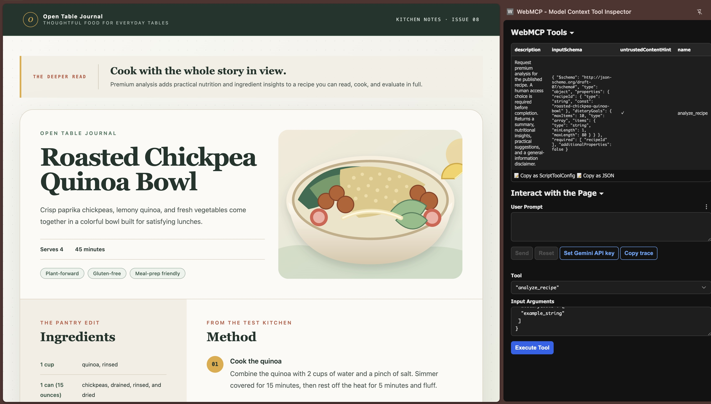
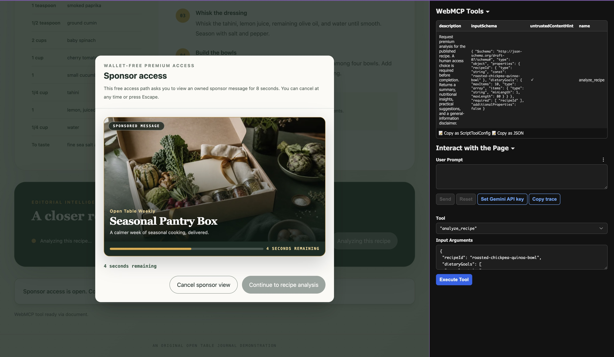
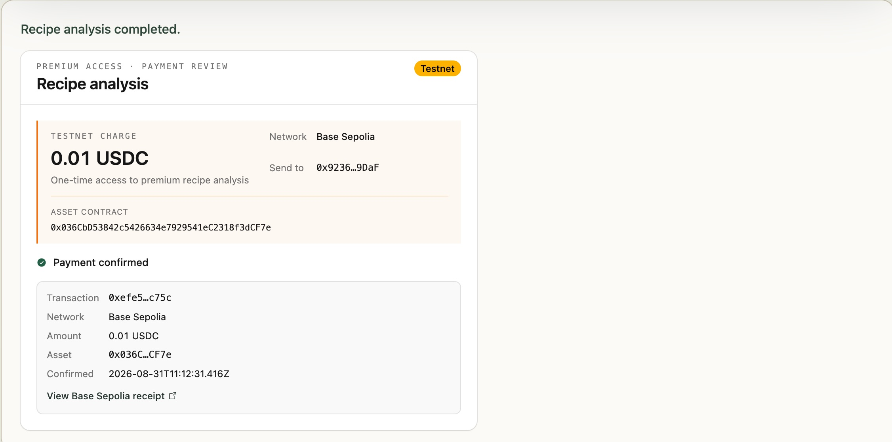
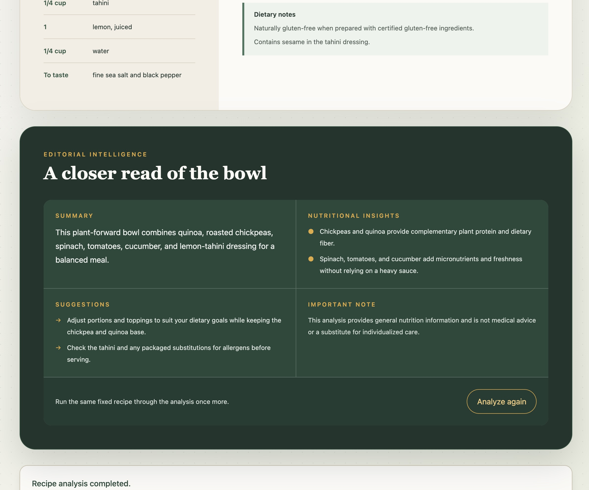

# AdGate for WebMCP

**Give agent requests an explicit payment path while keeping a sponsor-supported path available to people.**

AdGate is a hackathon prototype built around a fictional food publisher, **Open
Table Journal**. Its `analyze_recipe` WebMCP tool pauses the original agent
invocation and opens the explicit Base Sepolia payment review. The visible
publisher UI separately offers a wallet-free sponsor-supported analysis path:

1. **WebMCP / agent access** — explicitly approve an x402 `exact` payment of
   0.01 testnet USDC on Base Sepolia.
2. **Publisher UI access** — view an owned sponsor message for eight visible
   seconds to start a separate sponsor-supported analysis request.

Both paths authorize the same protected recipe-analysis endpoint and return the
same result contract. They intentionally begin from different entry points:
the agent invocation remains associated with payment, while sponsor access is a
new request started by the person in the publisher UI.

## Live demo

- **Public app:** <https://adgate-frontend.avp-104-106-107-a78.workers.dev/>
- **Public source:** <https://github.com/mashharuki/OpenAI-WebMCP-Challenge-Hackathon2026>
- **Demo video:** <https://youtu.be/FKDXyClLxJY>
- **License:** [MIT](./LICENSE)

The sponsor path is the required live judging path and needs no wallet. The
payment path is testnet-only and may be presented as a same-release recording
when the hosted facilitator is unavailable.

## See the flow

| WebMCP payment review | Human-controlled sponsor access |
| --- | --- |
|  |  |

| x402 payment receipt | Canonical recipe-analysis result |
| --- | --- |
|  |  |

The demo video shows the payment-approved WebMCP invocation and the separate
sponsor-supported publisher journey. A sponsor completion does not resume a
previously declined or cancelled WebMCP invocation.

## The problem

Publishers often fund free content with human attention. Agent-driven browsing
can deliver useful answers without a person visiting the page or seeing the
funding experience. A publisher then faces a poor choice: block agents, give
premium work away, or remove the free path.

AdGate demonstrates two transparent routes. An agent-invoked WebMCP tool can
remain pending while the person reviews payment terms and explicitly approves
the payment. People who prefer free, sponsor-supported access can instead
start that route directly from the publisher page.

## What works today

- One strict imperative WebMCP tool, `analyze_recipe`, registered against
  `document.modelContext` with a `navigator.modelContext` compatibility fallback.
- One visible publisher action backed by the same coordinator and Zod contracts.
- A wallet-free sponsor flow with page-visibility accounting, an independent
  server-side eight-second minimum, a one-time 60-second grant, and safe cancellation.
- A Base Sepolia x402 path with terms shown before wallet access, explicit user
  confirmation, and a normalized settlement receipt.
- A named Durable Object coordinator with sponsor sessions, grants,
  consumption state, and grant-issue replay persisted in Durable Object
  Storage, plus a bounded in-memory protected-attempt replay registry.
- Safe unsupported-host, registration-failure, duplicate, abort, expired-access,
  wrong-network, and dependency-failure outcomes.
- A read-only public smoke probe and a single local release command.

## Architecture

```text
WebMCP host                         Visible publisher UI
          |
          v
React publisher + GateCoordinator
          |
          +---------------+-------------------+
          |                                   |
          v                                   v
injected wallet approval              8-second sponsor view
          |                                   |
signed x402 payload                   one-time sponsor grant
          |                                   |
          +----------------+------------------+
                           v
                 Hono resource server
                           |
                  protected analysis
                           |
                           v
       payment invocation resolves / UI renders result
```

| App | Responsibility | Trust boundary |
| --- | --- | --- |
| [`apps/frontend`](./apps/frontend/) | Publisher UI, WebMCP registration, human gate, sponsor timer, injected-wallet adapter | Treats tool input, HTTP responses, and wallet responses as untrusted |
| [`apps/server`](./apps/server/) | Sponsor sessions/grants, bounded attempt state, protected analysis, x402 challenge | Owns authorization and never trusts browser elapsed-time claims |
| [`apps/facilitator`](./apps/facilitator/) | Optional x402 verification and settlement | Holds the testnet signer only in its secret store |

See [architecture and provenance](./docs/architecture-and-provenance.md) for
the detailed data flow, trust boundaries, and before/after project history.

## Local setup

Prerequisites:

- Node.js 24.20.0 (`nvm use` reads [`.nvmrc`](./.nvmrc))
- Corepack with the repository-pinned pnpm version
- Chromium only when running the browser E2E suite

```bash
nvm use
corepack enable
pnpm install --frozen-lockfile
```

Run the resource server and frontend in separate terminals:

```bash
pnpm --filter x402server run dev
pnpm --filter frontend run start
```

Open <http://localhost:5173>. The Vite development proxy sends `/api` to the
local server. Sponsor access works without an injected wallet. For the optional
local payment path, start the facilitator separately and provide only testnet
configuration through uncommitted environment files.

The app-specific runbooks provide focused instructions:

- [Frontend and WebMCP host setup](./apps/frontend/README.md)
- [Resource server](./apps/server/README.md)
- [Optional facilitator](./apps/facilitator/README.md)
- [Environment reference](./docs/environment.md)

## Testing

Run the complete deterministic release gate:

```bash
pnpm release:check
```

It performs the frozen install check, Biome, documentation checks, all app
tests/types/builds, fake-host Chromium E2E, cross-app contracts, public-probe
tests, and payment-boundary validation. It does not use a real wallet, private
key, mainnet, or external transaction.

Useful focused commands:

```bash
pnpm --filter frontend run test
pnpm --filter frontend run test:e2e
pnpm --filter x402server run test
pnpm --filter facilitator run test
```

After deployment, validate public boundaries without mutating external state:

```bash
pnpm smoke:public -- \
  --frontend-url https://frontend.example.com \
  --server-url https://api.example.com \
  --facilitator-url https://facilitator.example.com
```

## Deployment

The intended judging topology runs the frontend, resource server, and optional
facilitator on Cloudflare. The resource server routes through one named Durable
Object coordinator and persists sponsor authorization state in Durable Object
Storage. Public CORS must name the exact frontend origin. Frontend and server
must carry the same full release SHA, and the Origin Trial token must be issued
for the final frontend origin.

Follow the [deployment runbook](./docs/deployment.md). It identifies which
values are public, which are secrets, and how to disable payment safely while
keeping sponsor access live.

## Hackathon provenance

The repository began from a small React/WebMCP Todo starter. That prior work
provided the workspace shell, frontend tool-registration experiment, and basic
Cloudflare setup. During the hackathon, the product-facing Todo experience was
replaced with the Open Table Journal publisher demo and the AdGate system was
built: shared gate orchestration, sponsor credentials, protected analysis,
x402 payment, facilitator boundaries, fake-host E2E, release checks, deployment
controls, and submission materials.

The obsolete Todo/D1 guide has been removed from the working tree; Git history
retains the original reference. Some unused Todo starter modules remain only
as provenance and are not imported by the shipped publisher application.
Details and ownership boundaries are recorded in
[architecture and provenance](./docs/architecture-and-provenance.md).

## Owned demo assets

**Open Table Journal**, **Open Table Weekly**, the recipe copy, sponsor copy,
CSS presentation, and `roasted-chickpea-quinoa-bowl.svg` are original fictional
demo assets in this repository. The sponsor creative uses no tracking pixel or
external media. See the [asset-rights checklist](./docs/asset-rights.md) before
capturing or publishing submission media.

## Known limitations

- WebMCP and its browser exposure remain experimental; real-host checks are manual.
- Sponsor verification proves elapsed visible/session time, not human attention
  or fraud-resistant advertising measurement.
- Sponsor sessions, grants, consumption state, and grant-issue replay survive
  Worker isolate replacement through Durable Object Storage. The separate
  protected-analysis attempt/result replay registry remains in memory inside
  the named coordinator. An eviction or deployment therefore removes its
  five-minute result replay; if a final response was lost after evidence was
  consumed, the client must begin a new access attempt.
- Payment is fixed to Base Sepolia (`eip155:84532`), x402 `exact`, and 0.01
  testnet USDC. It is not a mainnet payment product.
- The self-hosted facilitator is a prototype without the authentication, rate
  limits, monitoring, and treasury controls required for production.
- Recipe analysis is deterministic demo output, not medical advice or a live LLM call.
